# 保戶基本資料管理系統 (PolicyHolder Management System)

[](https://openjdk.java.net/)
[](https://spring.io/projects/spring-boot)
[]()
[]()
[](LICENSE)

人壽保險保戶基本資料管理系統，提供保戶與保單的完整生命週期管理。

---

## 目錄

- [專案概述](#專案概述)
- [架構原理詳細說明](#架構原理詳細說明)
  - [SOLID 原則](#solid-原則)
  - [CQRS 模式](#cqrs-模式-command-query-responsibility-segregation)
  - [Event Store 模式](#event-store-模式)
  - [BDD 測試方法論](#bdd-測試方法論-behavior-driven-development)
- [架構設計圖](#架構設計圖)
  - [六角形架構圖](#六角形架構圖)
  - [系統元件圖](#系統元件圖)
  - [CQRS 架構圖](#cqrs-架構圖)
- [類別圖](#類別圖)
  - [領域層類別圖](#領域層類別圖)
  - [應用層類別圖](#應用層類別圖)
  - [基礎設施層類別圖](#基礎設施層類別圖)
- [時序圖](#時序圖)
  - [新增保戶時序圖](#新增保戶時序圖)
  - [查詢保戶時序圖](#查詢保戶時序圖)
  - [新增保單時序圖](#新增保單時序圖)
  - [刪除保戶時序圖](#刪除保戶時序圖)
- [ER Diagram](#er-diagram)
- [狀態圖](#狀態圖)
- [專案結構](#專案結構)
- [API 端點](#api-端點)
- [快速開始](#快速開始)

---

## 專案概述

本系統是一個基於 **Domain-Driven Design (DDD)** 設計的企業級應用程式，採用 **六角形架構 (Hexagonal Architecture)** 與 **CQRS Level 2** 模式，提供符合 **OpenAPI 3.0** 規範的 RESTful API。

### 已實作功能 (User Stories)

| User Story | 功能 | API | 狀態 |
|------------|------|-----|------|
| US1 | 新增保戶資料 | `POST /api/v1/policyholders` | ✅ |
| US2 | 查詢保戶資料 | `GET /api/v1/policyholders/{id}` | ✅ |
| US3 | 修改保戶資料 | `PUT /api/v1/policyholders/{id}` | ✅ |
| US4 | 刪除保戶資料 | `DELETE /api/v1/policyholders/{id}` | ✅ |
| US5 | 新增保單 | `POST /api/v1/policyholders/{id}/policies` | ✅ |
| US6 | 查詢保單 | `GET /api/v1/policyholders/{id}/policies` | ✅ |

### 技術亮點

- ✅ Domain-Driven Design 戰術設計模式
- ✅ 六角形架構（端口與適配器）
- ✅ CQRS Level 2（讀寫模型分離）
- ✅ 領域事件持久化 (Event Store)
- ✅ SOLID 原則
- ✅ ArchUnit 架構測試
- ✅ TDD/BDD 測試驅動開發
- ✅ 台灣身分證字號驗證

---

## 架構原理詳細說明

### SOLID 原則

本專案嚴格遵循 **SOLID** 五大設計原則，確保程式碼的可維護性、可擴展性與可測試性。

#### 1. 單一職責原則 (Single Responsibility Principle, SRP)

> 一個類別應該只有一個引起它變化的原因。

**專案實踐:**

```
✅ Command Handler 只負責處理單一命令
   └── CreatePolicyHolderCommandHandler.java  → 只處理「建立保戶」
   └── UpdatePolicyHolderCommandHandler.java  → 只處理「更新保戶」
   └── DeletePolicyHolderCommandHandler.java  → 只處理「刪除保戶」

✅ Value Object 各自封裝特定的業務規則
   └── NationalId.java    → 只負責身分證字號驗證
   └── Money.java         → 只負責金額運算
   └── Address.java       → 只負責地址相關邏輯

✅ Mapper 只負責轉換
   └── PolicyHolderMapper.java  → Domain ↔ JPA Entity
   └── ResponseMapper.java      → Domain → Response DTO
```

**程式碼範例:**

```java
// ❌ 錯誤：一個類別做太多事情
public class PolicyHolderService {
    public void create(...) { /* 建立 */ }
    public void update(...) { /* 更新 */ }
    public void delete(...) { /* 刪除 */ }
    public void query(...) { /* 查詢 */ }
    public void validateNationalId(...) { /* 驗證 */ }
    public void sendEmail(...) { /* 發信 */ }
}

// ✅ 正確：每個類別只有單一職責
public class CreatePolicyHolderCommandHandler {
    public PolicyHolderReadModel handle(CreatePolicyHolderCommand command) {
        // 只負責建立保戶的業務邏輯
    }
}
```

#### 2. 開放封閉原則 (Open/Closed Principle, OCP)

> 軟體實體應該對擴展開放，對修改封閉。

**專案實踐:**

```
✅ 使用介面定義 Port，新增實作不需修改既有程式碼
   └── PolicyHolderRepository (interface)
       ├── PolicyHolderRepositoryAdapter (JPA 實作)
       └── 未來可新增: PolicyHolderRedisAdapter (快取實作)

✅ 領域事件可擴展而不修改 Aggregate
   └── DomainEvent (abstract)
       ├── PolicyHolderCreated
       ├── PolicyHolderUpdated
       ├── PolicyHolderDeleted
       └── PolicyAdded
```

**程式碼範例:**

```java
// 介面定義（封閉）
public interface PolicyHolderRepository {
    PolicyHolder save(PolicyHolder policyHolder);
    Optional<PolicyHolder> findById(PolicyHolderId id);
}

// 新增實作（開放）- 不修改既有程式碼
@Component
public class PolicyHolderJpaAdapter implements PolicyHolderRepository {
    // JPA 實作
}

// 未來可新增 Redis 實作
@Component
@Profile("cache")
public class PolicyHolderCacheAdapter implements PolicyHolderRepository {
    // Redis 實作 - 完全不影響既有程式碼
}
```

#### 3. 里氏替換原則 (Liskov Substitution Principle, LSP)

> 子類別必須能夠替換其基底類別。

**專案實踐:**

```
✅ 所有 DomainEvent 子類別都能被 DomainEventPublisher 處理
   └── DomainEventPublisher.publish(DomainEvent event)
       └── 可接受任何 DomainEvent 子類別

✅ Repository 介面的任何實作都可以互換使用
   └── CommandHandler 依賴 PolicyHolderRepository 介面
       └── 無論是 JPA、MongoDB 或 Mock 實作都可以正常運作
```

**程式碼範例:**

```java
// 基底類別定義契約
public abstract class DomainEvent {
    public abstract String getEventType();
    public abstract String getAggregateId();
    public abstract LocalDateTime getOccurredOn();
}

// 子類別遵循契約
public class PolicyHolderCreated extends DomainEvent {
    @Override
    public String getEventType() { return "PolicyHolderCreated"; }
    // ... 完全符合基底類別的契約
}

// 使用端可以替換任何子類別
public void publishAll(List<DomainEvent> events) {
    events.forEach(this::publish);  // 任何 DomainEvent 子類別都能正常運作
}
```

#### 4. 介面隔離原則 (Interface Segregation Principle, ISP)

> 客戶端不應該被強迫依賴它不使用的方法。

**專案實踐:**

```
✅ 讀寫分離的 Repository 介面
   └── PolicyHolderRepository      → 寫入操作 (save, findById)
   └── PolicyHolderQueryRepository → 讀取操作 (search, findAll)

✅ 細粒度的 Handler 介面
   └── CommandHandler<C, R>  → 只定義 handle 方法
   └── QueryHandler<Q, R>    → 只定義 handle 方法
```

**程式碼範例:**

```java
// ❌ 錯誤：大而全的介面
public interface PolicyHolderRepository {
    void save(...);
    void delete(...);
    PolicyHolder findById(...);
    Page<PolicyHolder> findAll(...);
    Page<PolicyHolder> searchByName(...);
    long count();
    // ... 更多方法
}

// ✅ 正確：細粒度的介面
public interface PolicyHolderRepository {       // 寫入端使用
    PolicyHolder save(PolicyHolder policyHolder);
    Optional<PolicyHolder> findById(PolicyHolderId id);
}

public interface PolicyHolderQueryRepository {  // 讀取端使用
    Page<PolicyHolderListItemReadModel> findAll(Pageable pageable);
    Page<PolicyHolderListItemReadModel> searchByName(String name, Pageable pageable);
}
```

#### 5. 依賴反轉原則 (Dependency Inversion Principle, DIP)

> 高層模組不應該依賴低層模組，兩者都應該依賴抽象。

**專案實踐:**

```
✅ Application Layer 定義介面，Infrastructure Layer 實作
   └── Application Layer:
       └── PolicyHolderRepository (interface)    ← 定義 Port
       └── DomainEventPublisher (interface)      ← 定義 Port
   └── Infrastructure Layer:
       └── PolicyHolderRepositoryAdapter         → 實作 Port
       └── DomainEventPublisherAdapter           → 實作 Port

✅ 依賴注入方向
   └── Controller → Handler → Repository (interface) ← Adapter
```

**程式碼範例:**

```java
// Application Layer 定義抽象（高層模組）
public interface PolicyHolderRepository {
    PolicyHolder save(PolicyHolder policyHolder);
    Optional<PolicyHolder> findById(PolicyHolderId id);
}

// Application Layer 依賴抽象
@Service
public class CreatePolicyHolderCommandHandler {
    private final PolicyHolderRepository repository;  // 依賴介面，而非具體實作

    public CreatePolicyHolderCommandHandler(PolicyHolderRepository repository) {
        this.repository = repository;
    }
}

// Infrastructure Layer 實作抽象（低層模組）
@Component
public class PolicyHolderRepositoryAdapter implements PolicyHolderRepository {
    private final PolicyHolderJpaRepository jpaRepository;
    // 實作細節...
}
```

**SOLID 原則在各層的體現:**

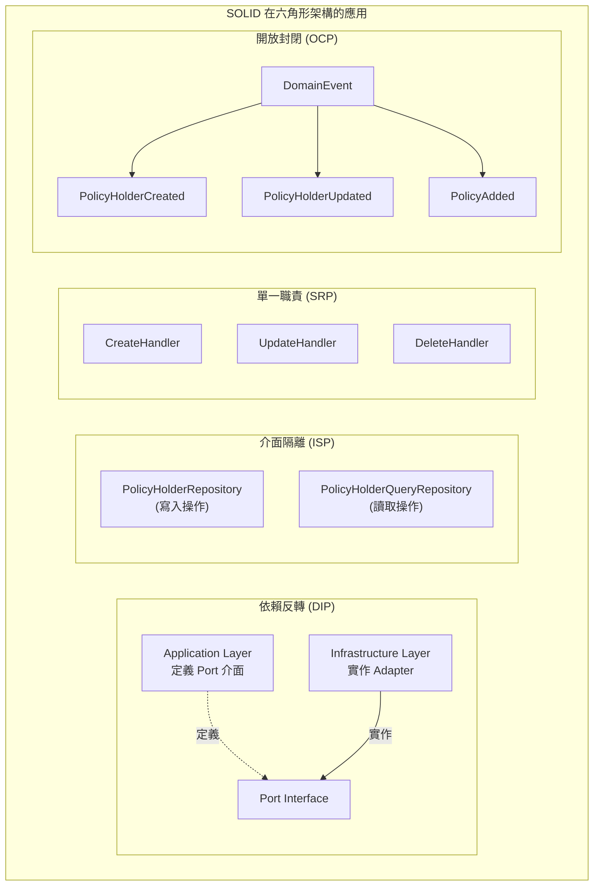

---

### CQRS 模式 (Command Query Responsibility Segregation)

**CQRS** 是一種將讀取（Query）和寫入（Command）操作分離的架構模式。本專案採用 **CQRS Level 2**，即讀寫模型分離但共用資料庫。

#### CQRS 三個層級

| Level | 說明 | 本專案 |
|-------|------|--------|
| Level 1 | 程式碼層級分離 Command/Query | ✅ |
| Level 2 | 讀寫模型分離 (Read Model / Write Model) | ✅ |
| Level 3 | 讀寫資料庫分離 (最終一致性) | ❌ |

#### 專案中的 CQRS 實作

**Command Side (寫入端):**

```
POST /api/v1/policyholders
    │
    ▼
CreatePolicyHolderCommand
    │
    ▼
CreatePolicyHolderCommandHandler
    │
    ├── 1. 使用 Domain Model (PolicyHolder Aggregate)
    ├── 2. 執行業務邏輯驗證
    ├── 3. 產生 Domain Events
    └── 4. 透過 Repository 持久化
```

**Query Side (讀取端):**

```
GET /api/v1/policyholders/{id}
    │
    ▼
GetPolicyHolderQuery
    │
    ▼
GetPolicyHolderQueryHandler
    │
    └── 直接回傳 Read Model (PolicyHolderReadModel)
        無需載入完整 Aggregate
```

#### Command 與 Query 的差異

```java
// Command：改變系統狀態，不回傳查詢結果
public record CreatePolicyHolderCommand(
    String nationalId,
    String name,
    String gender,
    LocalDate birthDate,
    String mobilePhone,
    String email,
    AddressData address
) {}

// Command Handler：執行業務邏輯
@Service
public class CreatePolicyHolderCommandHandler {
    public PolicyHolderReadModel handle(CreatePolicyHolderCommand command) {
        // 1. 驗證業務規則
        // 2. 建立 Aggregate
        // 3. 持久化
        // 4. 發布事件
        // 5. 回傳 Read Model
    }
}

// Query：只讀取資料，不改變系統狀態
public record GetPolicyHolderQuery(String policyHolderId) {}

// Query Handler：單純讀取
@Service
public class GetPolicyHolderQueryHandler {
    public Optional<PolicyHolderReadModel> handle(GetPolicyHolderQuery query) {
        // 直接從 Repository 讀取並轉換為 Read Model
    }
}
```

#### Read Model 設計

```java
// Read Model：為查詢最佳化的 DTO
public class PolicyHolderReadModel {
    private String id;
    private String nationalId;
    private String name;
    private String maskedNationalId;  // 預先計算的遮罩值
    private String fullAddress;        // 預先組合的完整地址
    private int policyCount;           // 預先計算的保單數量
    // ... 為顯示最佳化的欄位
}

// Write Model：Domain Aggregate
public class PolicyHolder {
    private PolicyHolderId id;
    private NationalId nationalId;     // Value Object，含驗證邏輯
    private PersonalInfo personalInfo; // Value Object
    private ContactInfo contactInfo;   // Value Object
    private Address address;           // Value Object
    private List<Policy> policies;     // Entity Collection
    private List<DomainEvent> events;  // 領域事件
    // ... 完整的業務邏輯
}
```

#### CQRS 架構優勢

| 優勢 | 說明 |
|------|------|
| **效能優化** | 讀取可針對查詢最佳化，不受寫入模型限制 |
| **擴展性** | 讀寫可獨立擴展 |
| **簡化複雜度** | 寫入處理業務邏輯，讀取單純回傳資料 |
| **可測試性** | Command/Query Handler 可獨立測試 |

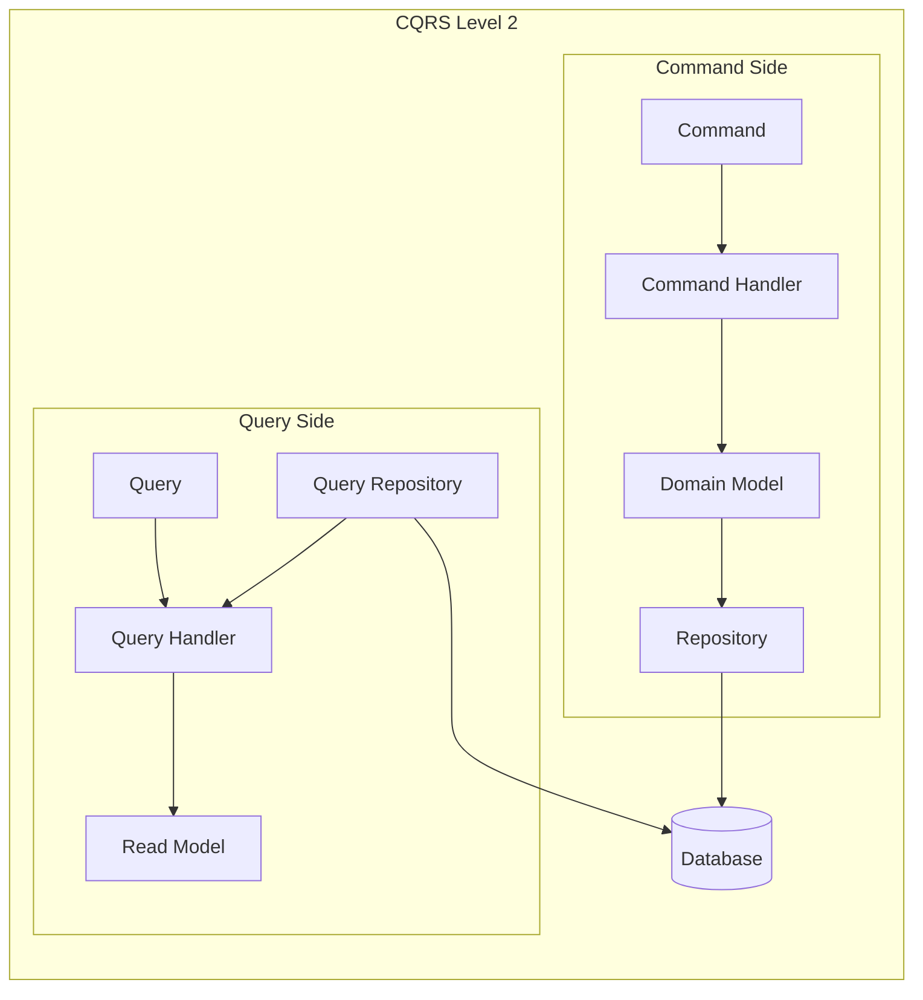

---

### Event Store 模式

**Event Store** 是一種將領域事件持久化的模式，用於記錄系統中所有狀態變化的歷史。

#### Event Store 的目的

| 用途 | 說明 |
|------|------|
| **審計追蹤** | 完整記錄所有業務操作的歷史 |
| **事件溯源** | 可重建任意時間點的系統狀態 |
| **事件驅動** | 支援非同步事件處理 |
| **除錯分析** | 追蹤問題發生的完整脈絡 |

#### 專案中的 Event Store 實作

**領域事件定義:**

```java
public abstract class DomainEvent {
    private final String eventId;         // 事件唯一識別碼
    private final String aggregateId;     // 聚合根 ID
    private final LocalDateTime occurredOn; // 發生時間

    public abstract String getEventType();
}

// 具體事件
public class PolicyHolderCreated extends DomainEvent {
    private final String policyHolderId;
    private final String nationalId;
    private final String name;
    private final String gender;
    private final LocalDate birthDate;
    private final String mobilePhone;
    private final String email;
    private final String fullAddress;
}

public class PolicyHolderUpdated extends DomainEvent {
    private final PolicyHolder updatedPolicyHolder;
}

public class PolicyAdded extends DomainEvent {
    private final String policyHolderId;
    private final Policy policy;
}
```

**Event Store 持久化:**

```java
@Entity
@Table(name = "domain_events")
public class DomainEventJpaEntity {
    @Id
    private String eventId;

    private String aggregateId;
    private String aggregateType;
    private String eventType;

    @Lob
    private String eventData;    // JSON 序列化的事件資料

    private LocalDateTime occurredOn;
    private boolean published;
    private LocalDateTime publishedAt;
}
```

**事件發布流程:**

```java
@Component
public class DomainEventPublisherAdapter implements DomainEventPublisher {
    private final EventStore eventStore;
    private final ApplicationEventPublisher springEventPublisher;

    @Override
    @Transactional
    public void publish(DomainEvent event) {
        // 1. 先持久化到 Event Store
        eventStore.save(event);

        // 2. 再發布到 Spring Event Bus
        springEventPublisher.publishEvent(event);
    }

    @Override
    public void publishAll(List<DomainEvent> events) {
        events.forEach(this::publish);
    }
}
```

#### Event Store 查詢能力

```java
public interface EventStore {
    // 儲存事件
    void save(DomainEvent event);
    void saveAll(List<DomainEvent> events);

    // 查詢事件
    List<DomainEvent> findByAggregateId(String aggregateId);
    List<DomainEvent> findByEventType(String eventType);
    List<DomainEvent> findByTimeRange(LocalDateTime start, LocalDateTime end);
}
```

#### Event Store 資料範例

```json
{
  "eventId": "550e8400-e29b-41d4-a716-446655440000",
  "aggregateId": "PH0000000001",
  "aggregateType": "PolicyHolder",
  "eventType": "PolicyHolderCreated",
  "eventData": {
    "policyHolderId": "PH0000000001",
    "nationalId": "A123456789",
    "name": "王小明",
    "gender": "MALE",
    "birthDate": "1990-01-15",
    "mobilePhone": "0912345678",
    "email": "wang@example.com",
    "fullAddress": "10001 台北市信義區測試路123號"
  },
  "occurredOn": "2024-01-15T10:30:00",
  "published": true,
  "publishedAt": "2024-01-15T10:30:01"
}
```

#### Event Store 架構圖

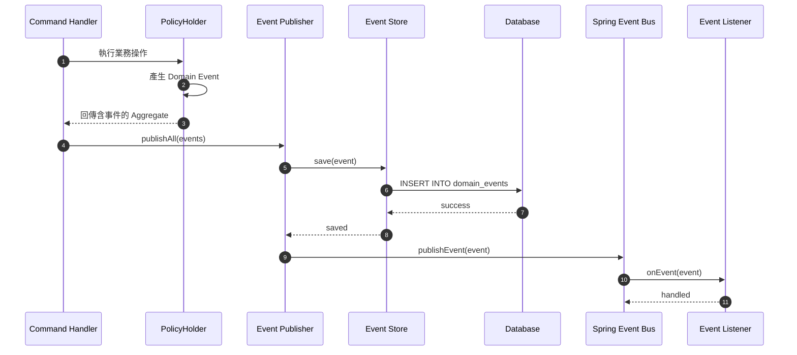

---

### BDD 測試方法論 (Behavior-Driven Development)

**BDD** 是一種以行為為導向的開發方法論，強調使用自然語言描述系統行為，讓開發人員、測試人員和業務人員能夠共同理解需求。

#### BDD 核心概念

| 概念 | 說明 |
|------|------|
| **Given** | 前置條件：系統的初始狀態 |
| **When** | 觸發動作：執行的操作 |
| **Then** | 預期結果：驗證的行為 |

#### 專案中的 BDD 測試風格

**Domain Layer 測試:**

```java
@DisplayName("PolicyHolder Tests")
class PolicyHolderTest {

    @Nested
    @DisplayName("建立保戶")
    class CreatePolicyHolder {

        @Test
        @DisplayName("should create policy holder with valid data")
        void shouldCreatePolicyHolderWithValidData() {
            // Given: 有效的保戶資料
            NationalId nationalId = NationalId.of("A123456789");
            PersonalInfo personalInfo = PersonalInfo.of("王小明", Gender.MALE,
                LocalDate.of(1990, 1, 15));
            ContactInfo contactInfo = ContactInfo.of("0912345678", "wang@example.com");
            Address address = Address.of("10001", "台北市", "信義區", "測試路123號");

            // When: 建立保戶
            PolicyHolder policyHolder = PolicyHolder.create(
                nationalId, personalInfo, contactInfo, address
            );

            // Then: 保戶應該被正確建立
            assertNotNull(policyHolder.getId());
            assertEquals("A123456789", policyHolder.getNationalId().getValue());
            assertEquals(PolicyHolderStatus.ACTIVE, policyHolder.getStatus());

            // And: 應該產生建立事件
            List<DomainEvent> events = policyHolder.getDomainEvents();
            assertEquals(1, events.size());
            assertInstanceOf(PolicyHolderCreated.class, events.get(0));
        }

        @Test
        @DisplayName("should reject invalid national ID")
        void shouldRejectInvalidNationalId() {
            // Given: 無效的身分證字號
            String invalidNationalId = "A123456780";  // 檢查碼錯誤

            // When & Then: 應該拋出驗證例外
            assertThrows(InvalidNationalIdException.class, () ->
                NationalId.of(invalidNationalId)
            );
        }
    }

    @Nested
    @DisplayName("新增保單")
    class AddPolicy {

        @Test
        @DisplayName("should add policy to active policy holder")
        void shouldAddPolicyToActivePolicyHolder() {
            // Given: 一個活動中的保戶
            PolicyHolder policyHolder = createActivePolicyHolder();
            policyHolder.clearEvents();

            // And: 一份有效的保單
            Policy policy = Policy.create(
                PolicyType.LIFE,
                Money.twd(10000),
                Money.twd(1000000),
                LocalDate.now(),
                LocalDate.now().plusYears(1)
            );

            // When: 新增保單
            policyHolder.addPolicy(policy);

            // Then: 保單應該被加入
            assertEquals(1, policyHolder.getPolicies().size());

            // And: 應該產生 PolicyAdded 事件
            List<DomainEvent> events = policyHolder.getDomainEvents();
            assertEquals(1, events.size());
            assertInstanceOf(PolicyAdded.class, events.get(0));
        }

        @Test
        @DisplayName("should not add policy to inactive policy holder")
        void shouldNotAddPolicyToInactivePolicyHolder() {
            // Given: 一個停用的保戶
            PolicyHolder policyHolder = createInactivePolicyHolder();
            Policy policy = createValidPolicy();

            // When & Then: 應該拋出業務例外
            assertThrows(PolicyHolderNotActiveException.class, () ->
                policyHolder.addPolicy(policy)
            );
        }
    }
}
```

**Application Layer 測試:**

```java
@DisplayName("CreatePolicyHolderCommandHandler Tests")
class CreatePolicyHolderCommandHandlerTest {

    @Nested
    @DisplayName("成功建立保戶")
    class SuccessfulCreation {

        @Test
        @DisplayName("should create policy holder and publish events")
        void shouldCreatePolicyHolderAndPublishEvents() {
            // Given: 有效的建立命令
            CreatePolicyHolderCommand command = new CreatePolicyHolderCommand(
                "A123456789", "王小明", "MALE",
                LocalDate.of(1990, 1, 15),
                "0912345678", "wang@example.com",
                new AddressData("10001", "台北市", "信義區", "測試路123號")
            );

            // And: Repository 回傳身分證字號不存在
            when(repository.existsByNationalId(any())).thenReturn(false);
            when(repository.save(any())).thenAnswer(i -> i.getArgument(0));

            // When: 執行建立命令
            PolicyHolderReadModel result = handler.handle(command);

            // Then: 保戶應該被儲存
            verify(repository).save(any(PolicyHolder.class));

            // And: 事件應該被發布
            verify(eventPublisher).publishAll(anyList());

            // And: 回傳正確的 Read Model
            assertNotNull(result.getId());
            assertEquals("王小明", result.getName());
        }
    }

    @Nested
    @DisplayName("建立失敗情況")
    class FailureScenarios {

        @Test
        @DisplayName("should reject duplicate national ID")
        void shouldRejectDuplicateNationalId() {
            // Given: 身分證字號已存在
            when(repository.existsByNationalId(any())).thenReturn(true);

            // When & Then: 應該拋出重複例外
            assertThrows(DuplicateNationalIdException.class, () ->
                handler.handle(validCommand)
            );

            // And: 不應該儲存或發布事件
            verify(repository, never()).save(any());
            verify(eventPublisher, never()).publishAll(any());
        }
    }
}
```

**Integration Test (BDD 風格):**

```java
@SpringBootTest
@AutoConfigureMockMvc
@DisplayName("PolicyHolder API Integration Tests")
class PolicyHolderIntegrationTest {

    @Nested
    @DisplayName("新增保戶 API")
    class CreatePolicyHolderApi {

        @Test
        @DisplayName("完整的保戶建立流程")
        void completePolicyHolderCreationFlow() throws Exception {
            // Given: 一個有效的建立保戶請求
            String request = """
                {
                    "nationalId": "A123456789",
                    "name": "王小明",
                    "gender": "MALE",
                    "birthDate": "1990-01-15",
                    "mobilePhone": "0912345678",
                    "email": "wang@example.com",
                    "address": {
                        "zipCode": "10001",
                        "city": "台北市",
                        "district": "信義區",
                        "street": "測試路123號"
                    }
                }
                """;

            // When: 發送 POST 請求
            MvcResult result = mockMvc.perform(post("/api/v1/policyholders")
                    .contentType(MediaType.APPLICATION_JSON)
                    .content(request))
                // Then: 應該回傳 201 Created
                .andExpect(status().isCreated())
                .andExpect(jsonPath("$.success").value(true))
                .andExpect(jsonPath("$.data.id").exists())
                .andExpect(jsonPath("$.data.name").value("王小明"))
                .andReturn();

            // And: 應該可以查詢到該保戶
            String policyHolderId = JsonPath.read(
                result.getResponse().getContentAsString(),
                "$.data.id"
            );

            mockMvc.perform(get("/api/v1/policyholders/{id}", policyHolderId))
                .andExpect(status().isOk())
                .andExpect(jsonPath("$.data.nationalId").value("A123456789"));

            // And: 事件應該被記錄到 Event Store
            List<DomainEventJpaEntity> events = eventRepository
                .findByAggregateIdOrderByOccurredOnAsc(policyHolderId);
            assertEquals(1, events.size());
            assertEquals("PolicyHolderCreated", events.get(0).getEventType());
        }
    }
}
```

#### 測試命名慣例

本專案採用描述性的測試命名，讓測試本身成為文件：

```java
// 使用 @DisplayName 提供中文描述
@DisplayName("保戶管理功能測試")
class PolicyHolderTest {

    // 使用巢狀類別組織相關測試
    @Nested
    @DisplayName("建立保戶")
    class CreatePolicyHolder {

        // 測試方法命名：should + 預期行為 + 條件
        @Test
        @DisplayName("應該成功建立具有有效資料的保戶")
        void shouldCreatePolicyHolderWithValidData() { }

        @Test
        @DisplayName("應該拒絕無效的身分證字號")
        void shouldRejectInvalidNationalId() { }

        @Test
        @DisplayName("應該拒絕重複的身分證字號")
        void shouldRejectDuplicateNationalId() { }
    }
}
```

#### BDD 測試金字塔

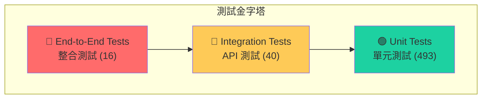

---

## 架構設計圖

### 六角形架構圖

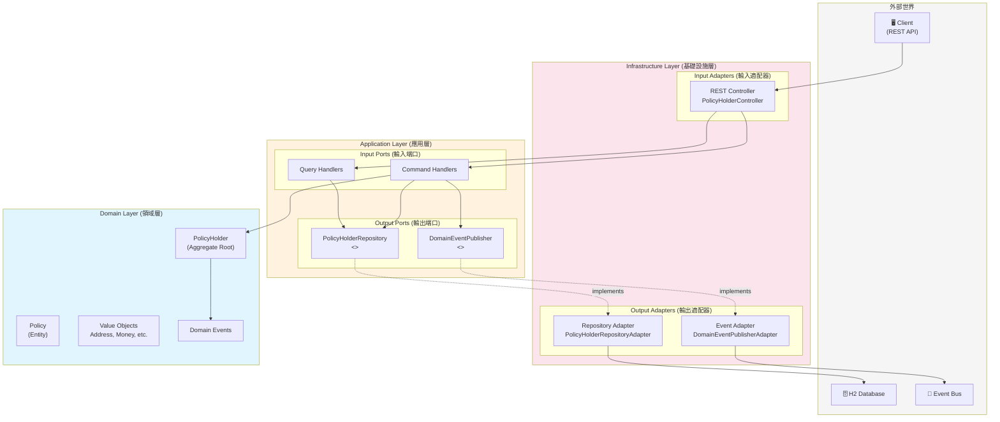

### 系統元件圖

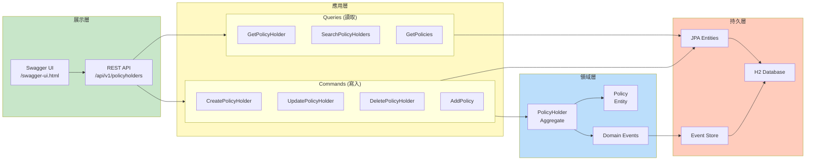

### CQRS 架構圖

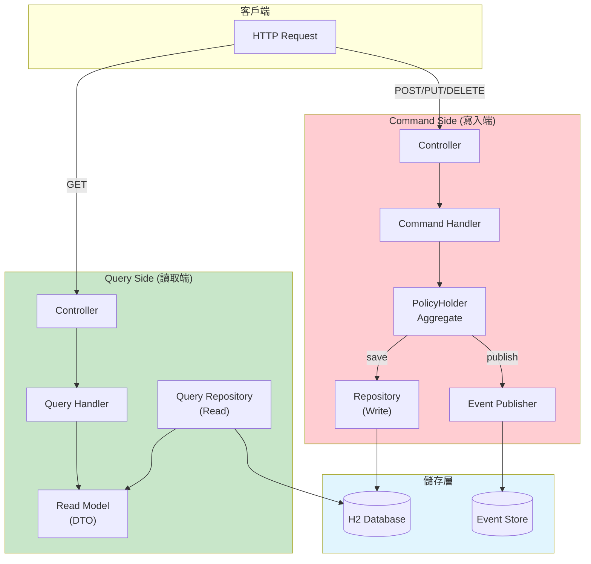

---

## 類別圖

### 領域層類別圖

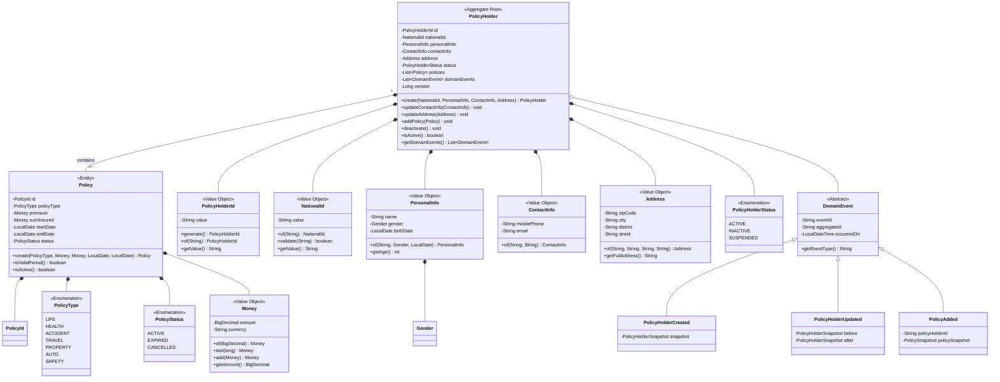

### 應用層類別圖


### 基礎設施層類別圖

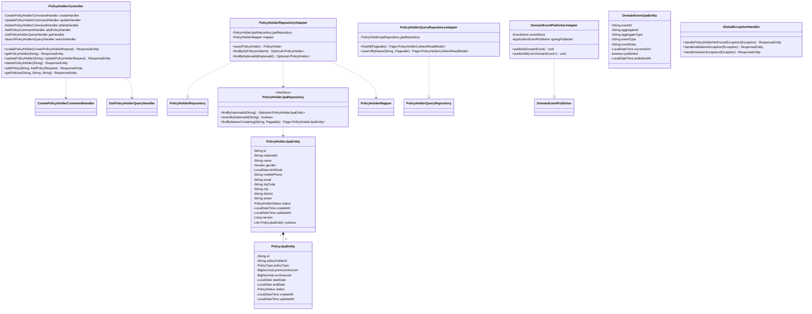

---

## 時序圖

### 新增保戶時序圖

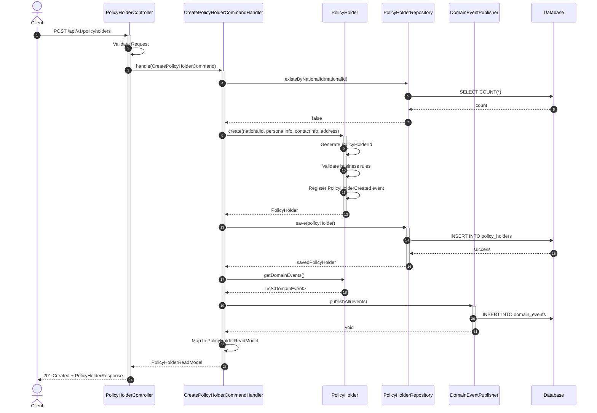

### 查詢保戶時序圖

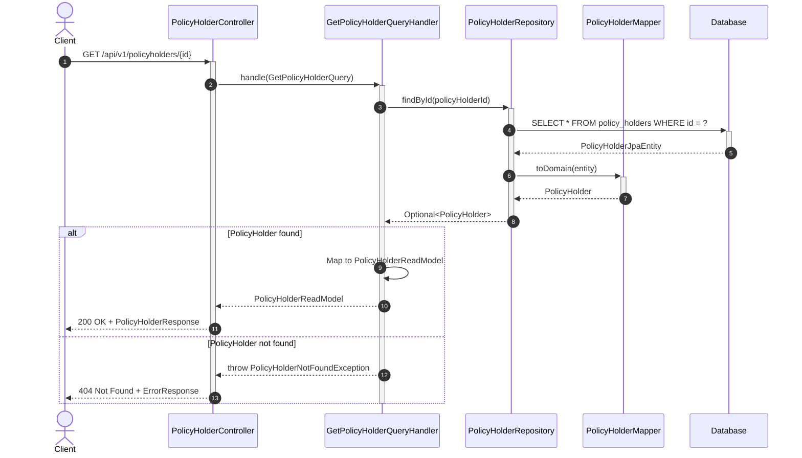

### 新增保單時序圖

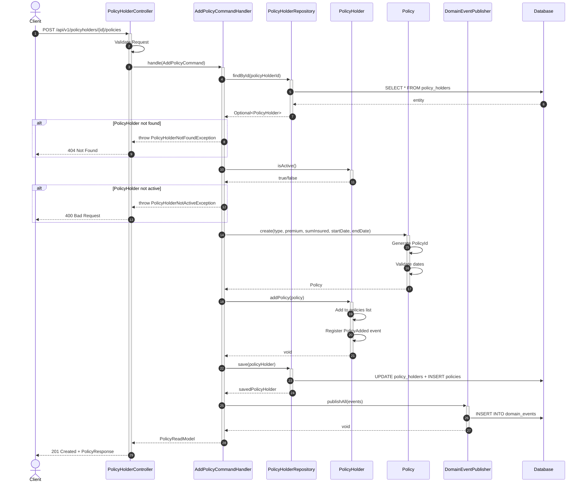

### 刪除保戶時序圖

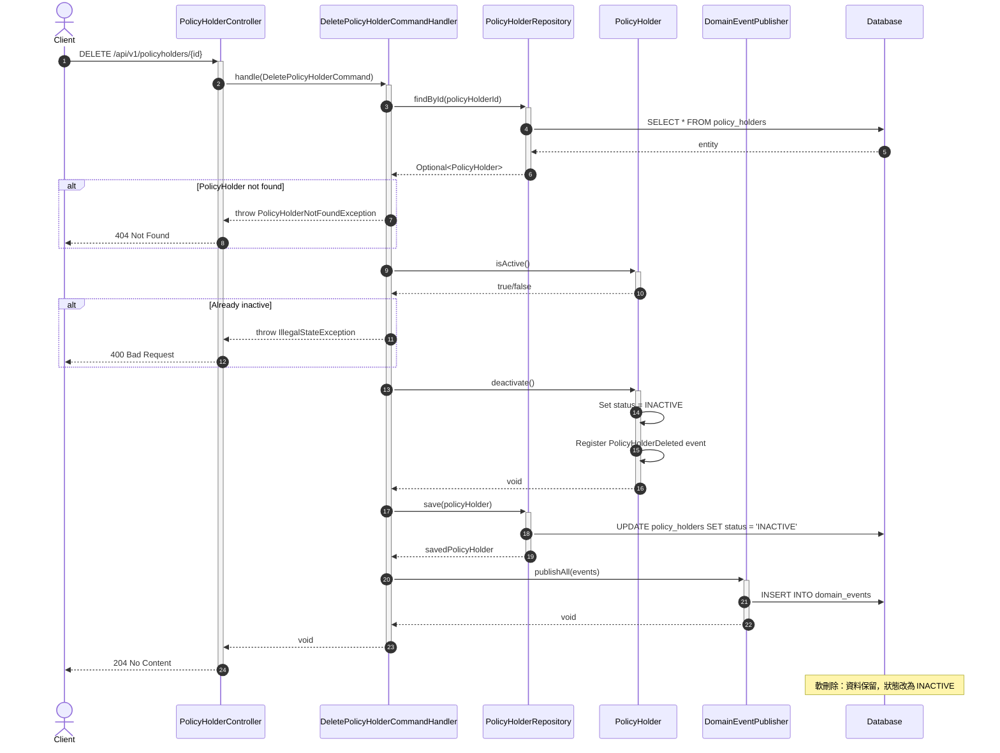

---

## ER Diagram

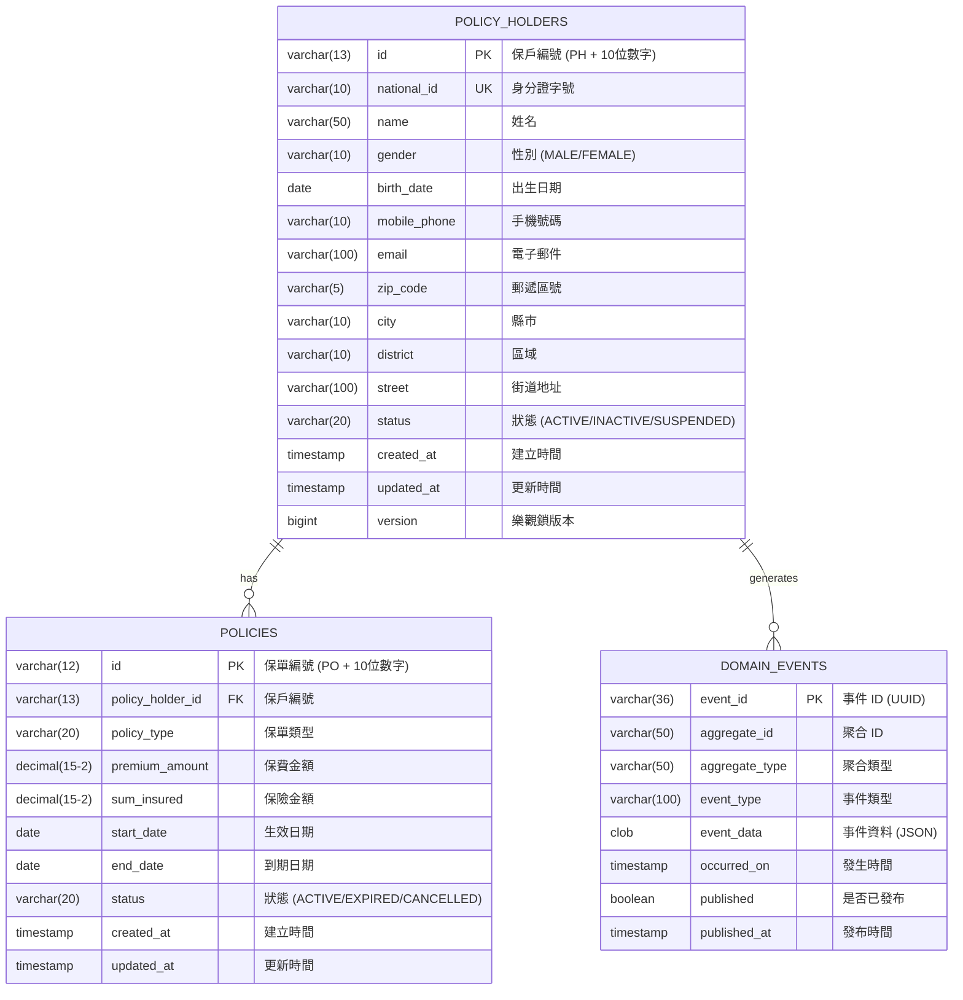

---

## 狀態圖

### 保戶狀態轉換

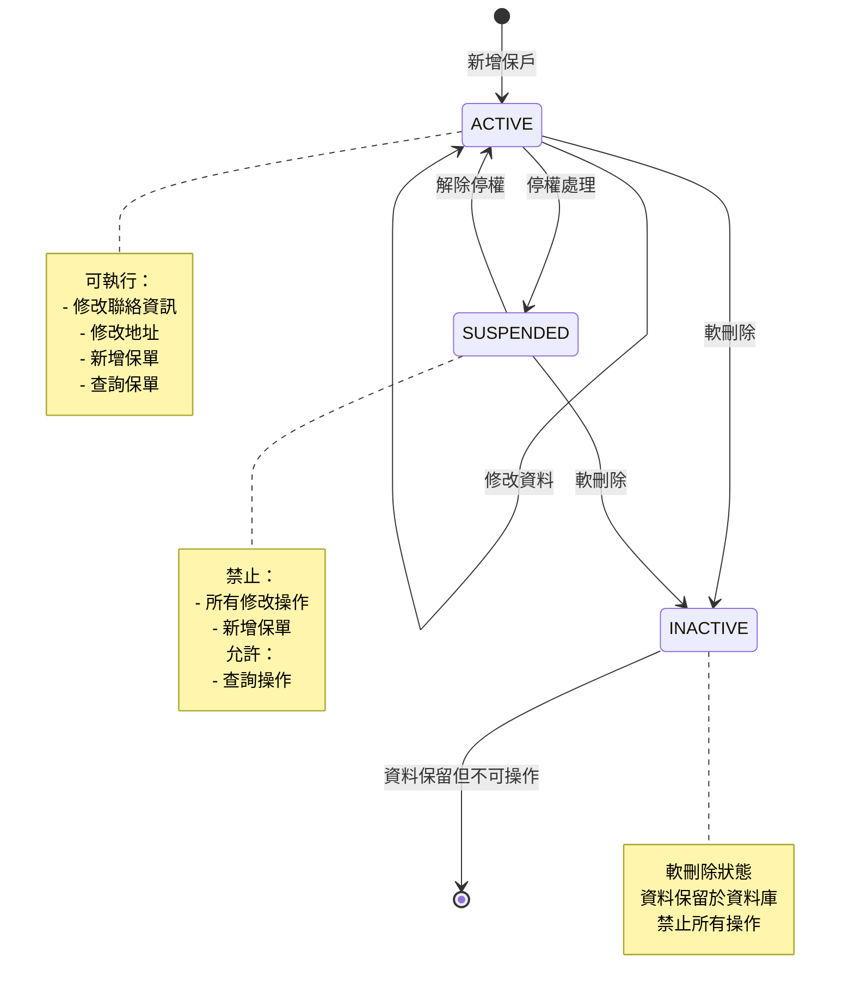

### 保單狀態轉換

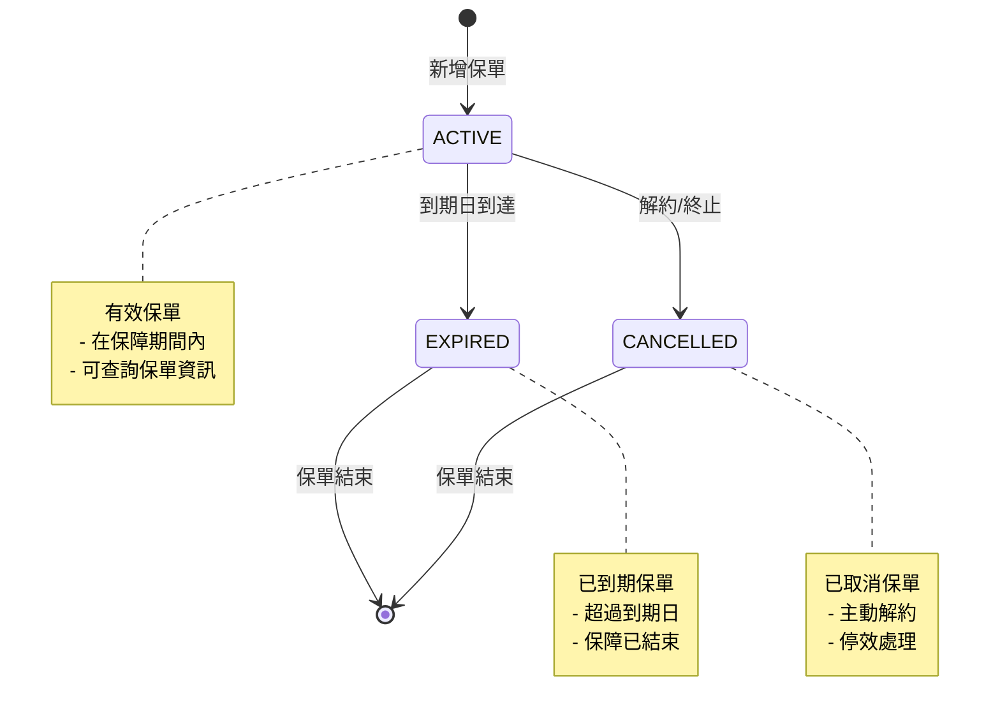

---

## 專案結構

```
src/main/java/com/insurance/policyholder/
│
├── domain/                          # 🔵 Domain Layer（最內層）
│   ├── model/
│   │   ├── aggregate/               # Aggregate Root
│   │   │   └── PolicyHolder.java
│   │   ├── entity/                  # Entity
│   │   │   └── Policy.java
│   │   ├── valueobject/             # Value Objects
│   │   │   ├── PolicyHolderId.java
│   │   │   ├── PolicyId.java
│   │   │   ├── NationalId.java
│   │   │   ├── PersonalInfo.java
│   │   │   ├── ContactInfo.java
│   │   │   ├── Address.java
│   │   │   └── Money.java
│   │   └── enums/                   # Domain Enums
│   ├── event/                       # Domain Events
│   ├── service/                     # Domain Services
│   └── exception/                   # Domain Exceptions
│
├── application/                     # 🟢 Application Layer
│   ├── command/                     # Commands (Write)
│   ├── commandhandler/              # Command Handlers
│   ├── query/                       # Queries (Read)
│   ├── queryhandler/                # Query Handlers
│   ├── readmodel/                   # Read Models (DTOs)
│   └── port/
│       ├── input/                   # Input Ports
│       └── output/                  # Output Ports
│
└── infrastructure/                  # 🟠 Infrastructure Layer（最外層）
    ├── adapter/
    │   ├── input/rest/              # REST API Adapter
    │   └── output/
    │       ├── persistence/         # JPA Adapter
    │       └── event/               # Event Store Adapter
    ├── config/                      # Spring Configurations
    └── exception/                   # Global Exception Handler
```

---

## API 端點

### 保戶管理 API

| Method | Endpoint | 說明 |
|--------|----------|------|
| `POST` | `/api/v1/policyholders` | 新增保戶 |
| `GET` | `/api/v1/policyholders/{id}` | 依 ID 查詢保戶 |
| `GET` | `/api/v1/policyholders/national-id/{nationalId}` | 依身分證字號查詢 |
| `GET` | `/api/v1/policyholders` | 搜尋保戶（支援分頁、篩選） |
| `PUT` | `/api/v1/policyholders/{id}` | 修改保戶聯絡資訊 |
| `DELETE` | `/api/v1/policyholders/{id}` | 軟刪除保戶 |

### 保單管理 API

| Method | Endpoint | 說明 |
|--------|----------|------|
| `POST` | `/api/v1/policyholders/{id}/policies` | 新增保單 |
| `GET` | `/api/v1/policyholders/{id}/policies` | 查詢保戶所有保單 |
| `GET` | `/api/v1/policyholders/{id}/policies/{policyId}` | 查詢單一保單 |

---

## 快速開始

### 前置需求

- JDK 17+
- Gradle 8+

### 建置與執行

```bash
# Clone 專案
git clone <repository-url>
cd insurance_management_architecture_demo

# 建置專案
gradle build

# 執行測試
gradle test

# 啟動應用程式
gradle bootRun
```

### 存取服務

| 服務 | URL |
|------|-----|
| API Base URL | http://localhost:8080/api/v1 |
| Swagger UI | http://localhost:8080/swagger-ui.html |
| OpenAPI Docs | http://localhost:8080/api-docs |
| H2 Console | http://localhost:8080/h2-console |

---

## 測試

### 測試統計

| 類型 | 數量 |
|------|------|
| 單元測試 | 517 |
| 整合測試 | 16 |
| 架構測試 | 16 |
| **總計** | **549** |

### 覆蓋率

| 指標 | 數值 |
|------|------|
| 指令覆蓋率 | 95% |
| 分支覆蓋率 | 83% |

### BDD 測試案例與測試對象映射

以下詳細列出每個 BDD 測試案例所測試的程式碼檔案，以及所驗證的設計原則。

#### Domain Layer 測試

| 測試類別 | 測試對象 | 設計原則 |
|----------|----------|----------|
| `PolicyHolderTest` | `PolicyHolder.java` | **DDD Aggregate Root**, **SRP** |
| `PolicyTest` | `Policy.java` | **DDD Entity**, **SRP** |
| `NationalIdTest` | `NationalId.java` | **DDD Value Object**, **SRP** |
| `MoneyTest` | `Money.java` | **DDD Value Object**, **SRP** |
| `PolicyIdTest` | `PolicyId.java` | **DDD Value Object**, **SRP** |
| `AddressTest` | `Address.java` | **DDD Value Object**, **SRP** |
| `ContactInfoTest` | `ContactInfo.java` | **DDD Value Object**, **SRP** |
| `PersonalInfoTest` | `PersonalInfo.java` | **DDD Value Object**, **SRP** |
| `PolicyHolderIdTest` | `PolicyHolderId.java` | **DDD Value Object**, **SRP** |
| `PolicyHolderDomainServiceTest` | `PolicyHolderDomainService.java` | **DDD Domain Service**, **SRP** |
| `DomainEventTest` | `DomainEvent.java`, `PolicyHolderCreated.java`, `PolicyHolderUpdated.java`, `PolicyHolderDeleted.java`, `PolicyAdded.java` | **Event Store**, **LSP**, **OCP** |
| `DomainExceptionTest` | `DomainException.java`, `PolicyHolderNotFoundException.java`, `PolicyHolderNotActiveException.java`, `PolicyNotFoundException.java` | **LSP**, **OCP** |

#### Application Layer 測試

| 測試類別 | 測試對象 | 設計原則 |
|----------|----------|----------|
| `CreatePolicyHolderCommandHandlerTest` | `CreatePolicyHolderCommandHandler.java`, `CreatePolicyHolderCommand.java` | **CQRS Command**, **SRP**, **DIP** |
| `UpdatePolicyHolderCommandHandlerTest` | `UpdatePolicyHolderCommandHandler.java`, `UpdatePolicyHolderCommand.java` | **CQRS Command**, **SRP**, **DIP** |
| `DeletePolicyHolderCommandHandlerTest` | `DeletePolicyHolderCommandHandler.java`, `DeletePolicyHolderCommand.java` | **CQRS Command**, **SRP**, **DIP** |
| `AddPolicyCommandHandlerTest` | `AddPolicyCommandHandler.java`, `AddPolicyCommand.java` | **CQRS Command**, **SRP**, **DIP** |
| `GetPolicyHolderQueryHandlerTest` | `GetPolicyHolderQueryHandler.java`, `GetPolicyHolderQuery.java` | **CQRS Query**, **SRP**, **DIP** |
| `GetPolicyQueryHandlerTest` | `GetPolicyQueryHandler.java`, `GetPolicyQuery.java` | **CQRS Query**, **SRP**, **DIP** |
| `GetPolicyHolderPoliciesQueryHandlerTest` | `GetPolicyHolderPoliciesQueryHandler.java`, `GetPolicyHolderPoliciesQuery.java` | **CQRS Query**, **SRP**, **DIP** |
| `SearchPolicyHoldersQueryHandlerTest` | `SearchPolicyHoldersQueryHandler.java`, `SearchPolicyHoldersQuery.java` | **CQRS Query**, **SRP**, **DIP** |
| `PagedResultTest` | `PagedResult.java` | **CQRS Read Model** |
| `PolicyHolderReadModelTest` | `PolicyHolderReadModel.java` | **CQRS Read Model** |
| `PolicyReadModelTest` | `PolicyReadModel.java` | **CQRS Read Model** |
| `PolicyHolderListItemReadModelTest` | `PolicyHolderListItemReadModel.java` | **CQRS Read Model** |

#### Infrastructure Layer 測試

| 測試類別 | 測試對象 | 設計原則 |
|----------|----------|----------|
| `PolicyHolderControllerCreateTest` | `PolicyHolderController.java` (POST) | **Hexagonal Input Adapter**, **SRP** |
| `PolicyHolderControllerQueryTest` | `PolicyHolderController.java` (GET) | **Hexagonal Input Adapter**, **SRP** |
| `PolicyHolderControllerUpdateTest` | `PolicyHolderController.java` (PUT) | **Hexagonal Input Adapter**, **SRP** |
| `PolicyHolderControllerDeleteTest` | `PolicyHolderController.java` (DELETE) | **Hexagonal Input Adapter**, **SRP** |
| `PolicyControllerAddTest` | `PolicyHolderController.java` (POST policies) | **Hexagonal Input Adapter**, **SRP** |
| `PolicyControllerQueryTest` | `PolicyHolderController.java` (GET policies) | **Hexagonal Input Adapter**, **SRP** |
| `PolicyHolderMapperTest` | `PolicyHolderMapper.java` | **SRP**, **Data Mapper Pattern** |
| `PolicyMapperTest` | `PolicyMapper.java` | **SRP**, **Data Mapper Pattern** |
| `GlobalExceptionHandlerTest` | `GlobalExceptionHandler.java` | **SRP**, **Cross-Cutting Concern** |
| `PolicyHolderRepositoryAdapterTest` | `PolicyHolderRepositoryAdapter.java`, `PolicyHolderRepository.java` (interface) | **Hexagonal Output Adapter**, **DIP**, **ISP** |
| `DomainEventPublisherAdapterTest` | `DomainEventPublisherAdapter.java`, `DomainEventPublisher.java` (interface) | **Hexagonal Output Adapter**, **DIP**, **Event Store** |
| `EventStoreAdapterTest` | `EventStoreAdapter.java`, `EventStore.java` (interface) | **Event Store**, **DIP** |
| `ApiResponseTest` | `ApiResponse.java` | **SRP** |
| `ErrorResponseTest` | `ErrorResponse.java` | **SRP** |
| `PageResponseTest` | `PageResponse.java` | **CQRS Read Model**, **SRP** |
| `AddressResponseTest` | `AddressResponse.java` | **SRP** |
| `PolicyHolderResponseTest` | `PolicyHolderResponse.java` | **SRP** |
| `PolicyResponseTest` | `PolicyResponse.java` | **SRP** |
| `PolicyHolderListItemResponseTest` | `PolicyHolderListItemResponse.java` | **SRP** |

#### 整合與架構測試

| 測試類別 | 測試對象 | 設計原則 |
|----------|----------|----------|
| `PolicyHolderIntegrationTest` | 完整系統 (Controller → Handler → Repository → Database) | **End-to-End**, **Hexagonal Architecture** |
| `ArchitectureTest` | 整體架構依賴規則 | **DIP**, **Layer Independence**, **Hexagonal Architecture** |

---

### 設計原則實踐對照表

以下詳細標註每個設計原則在哪些程式碼中實踐。

#### SOLID 原則實踐位置

##### S - 單一職責原則 (Single Responsibility Principle)

| 程式碼檔案 | 路徑 | 單一職責說明 |
|------------|------|--------------|
| `CreatePolicyHolderCommandHandler.java` | `application/commandhandler/` | 只負責建立保戶 |
| `UpdatePolicyHolderCommandHandler.java` | `application/commandhandler/` | 只負責更新保戶 |
| `DeletePolicyHolderCommandHandler.java` | `application/commandhandler/` | 只負責刪除保戶 |
| `AddPolicyCommandHandler.java` | `application/commandhandler/` | 只負責新增保單 |
| `GetPolicyHolderQueryHandler.java` | `application/queryhandler/` | 只負責查詢保戶 |
| `SearchPolicyHoldersQueryHandler.java` | `application/queryhandler/` | 只負責搜尋保戶 |
| `NationalId.java` | `domain/model/valueobject/` | 只負責身分證驗證邏輯 |
| `Money.java` | `domain/model/valueobject/` | 只負責金額運算邏輯 |
| `Address.java` | `domain/model/valueobject/` | 只負責地址相關邏輯 |
| `PolicyHolderMapper.java` | `infrastructure/.../mapper/` | 只負責領域模型與 JPA 實體轉換 |
| `PolicyMapper.java` | `infrastructure/.../mapper/` | 只負責保單模型與 JPA 實體轉換 |
| `GlobalExceptionHandler.java` | `infrastructure/exception/` | 只負責全域例外處理 |

##### O - 開放封閉原則 (Open/Closed Principle)

| 程式碼檔案 | 路徑 | OCP 實踐說明 |
|------------|------|--------------|
| `DomainEvent.java` | `domain/event/` | 抽象基底類別，新事件透過繼承擴展 |
| `PolicyHolderCreated.java` | `domain/event/` | 擴展 DomainEvent，不修改基底類別 |
| `PolicyHolderUpdated.java` | `domain/event/` | 擴展 DomainEvent，不修改基底類別 |
| `PolicyHolderDeleted.java` | `domain/event/` | 擴展 DomainEvent，不修改基底類別 |
| `PolicyAdded.java` | `domain/event/` | 擴展 DomainEvent，不修改基底類別 |
| `DomainException.java` | `domain/exception/` | 抽象例外基底類別 |
| `PolicyHolderNotFoundException.java` | `domain/exception/` | 擴展 DomainException |
| `PolicyHolderNotActiveException.java` | `domain/exception/` | 擴展 DomainException |
| `CommandHandler.java` | `application/port/input/` | 泛型介面允許新 Handler 擴展 |
| `QueryHandler.java` | `application/port/input/` | 泛型介面允許新 Handler 擴展 |

##### L - 里氏替換原則 (Liskov Substitution Principle)

| 程式碼檔案 | 路徑 | LSP 實踐說明 |
|------------|------|--------------|
| `DomainEvent.java` + 子類別 | `domain/event/` | 所有子類別可替換基底類別使用 |
| `DomainException.java` + 子類別 | `domain/exception/` | 所有子類別可替換基底類別使用 |
| `PolicyHolderRepository.java` | `application/port/output/` | 實作類別可替換介面使用 |
| `PolicyHolderRepositoryAdapter.java` | `infrastructure/.../adapter/` | 完全實作 Repository 介面契約 |
| `DomainEventPublisher.java` | `application/port/output/` | 介面定義發布契約 |
| `DomainEventPublisherAdapter.java` | `infrastructure/.../event/` | 完全實作 Publisher 介面契約 |

##### I - 介面隔離原則 (Interface Segregation Principle)

| 程式碼檔案 | 路徑 | ISP 實踐說明 |
|------------|------|--------------|
| `CommandHandler.java` | `application/port/input/` | 只有 1 個方法: `handle(C)` |
| `QueryHandler.java` | `application/port/input/` | 只有 1 個方法: `handle(Q)` |
| `PolicyHolderRepository.java` | `application/port/output/` | 寫入端介面: `save`, `findById`, `existsByNationalId` |
| `PolicyHolderQueryRepository.java` | `application/port/output/` | 讀取端介面: `findAll`, `searchByName`, `findByStatus` |
| `DomainEventPublisher.java` | `application/port/output/` | 只有 2 個方法: `publish`, `publishAll` |
| `EventStore.java` | `application/port/output/` | 事件儲存介面: `save`, `saveAll`, `findByAggregateId` |

##### D - 依賴反轉原則 (Dependency Inversion Principle)

| 高層模組 | 抽象介面 | 低層實作 |
|----------|----------|----------|
| `CreatePolicyHolderCommandHandler.java` | `PolicyHolderRepository.java` | `PolicyHolderRepositoryAdapter.java` |
| `CreatePolicyHolderCommandHandler.java` | `DomainEventPublisher.java` | `DomainEventPublisherAdapter.java` |
| `UpdatePolicyHolderCommandHandler.java` | `PolicyHolderRepository.java` | `PolicyHolderRepositoryAdapter.java` |
| `DeletePolicyHolderCommandHandler.java` | `PolicyHolderRepository.java` | `PolicyHolderRepositoryAdapter.java` |
| `AddPolicyCommandHandler.java` | `PolicyHolderRepository.java` | `PolicyHolderRepositoryAdapter.java` |
| `GetPolicyHolderQueryHandler.java` | `PolicyHolderRepository.java` | `PolicyHolderRepositoryAdapter.java` |
| `SearchPolicyHoldersQueryHandler.java` | `PolicyHolderQueryRepository.java` | `PolicyHolderQueryRepositoryAdapter.java` |
| `DomainEventPublisherAdapter.java` | `EventStore.java` | `EventStoreAdapter.java` |

---

#### CQRS 模式實踐位置

##### Command Side (寫入端)

| 類型 | 程式碼檔案 | 說明 |
|------|------------|------|
| **Command** | `CreatePolicyHolderCommand.java` | 建立保戶命令 DTO |
| **Command** | `UpdatePolicyHolderCommand.java` | 更新保戶命令 DTO |
| **Command** | `DeletePolicyHolderCommand.java` | 刪除保戶命令 DTO |
| **Command** | `AddPolicyCommand.java` | 新增保單命令 DTO |
| **Command Handler** | `CreatePolicyHolderCommandHandler.java` | 處理建立保戶命令 |
| **Command Handler** | `UpdatePolicyHolderCommandHandler.java` | 處理更新保戶命令 |
| **Command Handler** | `DeletePolicyHolderCommandHandler.java` | 處理刪除保戶命令 |
| **Command Handler** | `AddPolicyCommandHandler.java` | 處理新增保單命令 |
| **Write Repository** | `PolicyHolderRepository.java` | 寫入端 Repository 介面 |
| **Write Model** | `PolicyHolder.java` | 寫入端 Aggregate Root |
| **Write Model** | `Policy.java` | 寫入端 Entity |

##### Query Side (讀取端)

| 類型 | 程式碼檔案 | 說明 |
|------|------------|------|
| **Query** | `GetPolicyHolderQuery.java` | 查詢保戶 Query DTO |
| **Query** | `GetPolicyHolderPoliciesQuery.java` | 查詢保單列表 Query DTO |
| **Query** | `GetPolicyQuery.java` | 查詢單一保單 Query DTO |
| **Query** | `SearchPolicyHoldersQuery.java` | 搜尋保戶 Query DTO |
| **Query Handler** | `GetPolicyHolderQueryHandler.java` | 處理查詢保戶 |
| **Query Handler** | `GetPolicyHolderPoliciesQueryHandler.java` | 處理查詢保單列表 |
| **Query Handler** | `GetPolicyQueryHandler.java` | 處理查詢單一保單 |
| **Query Handler** | `SearchPolicyHoldersQueryHandler.java` | 處理搜尋保戶 |
| **Read Repository** | `PolicyHolderQueryRepository.java` | 讀取端 Repository 介面 |
| **Read Model** | `PolicyHolderReadModel.java` | 保戶讀取模型 |
| **Read Model** | `PolicyReadModel.java` | 保單讀取模型 |
| **Read Model** | `PolicyHolderListItemReadModel.java` | 保戶列表項目讀取模型 |
| **Read Model** | `PagedResult.java` | 分頁結果讀取模型 |

---

#### Event Store 模式實踐位置

| 類型 | 程式碼檔案 | 說明 |
|------|------------|------|
| **Domain Event Base** | `DomainEvent.java` | 領域事件抽象基底類別 |
| **Domain Event** | `PolicyHolderCreated.java` | 保戶建立事件 |
| **Domain Event** | `PolicyHolderUpdated.java` | 保戶更新事件 |
| **Domain Event** | `PolicyHolderDeleted.java` | 保戶刪除事件 |
| **Domain Event** | `PolicyAdded.java` | 保單新增事件 |
| **Event Store Port** | `EventStore.java` | 事件儲存介面 (Output Port) |
| **Event Store Adapter** | `EventStoreAdapter.java` | 事件儲存實作 |
| **Event Publisher Port** | `DomainEventPublisher.java` | 事件發布介面 (Output Port) |
| **Event Publisher Adapter** | `DomainEventPublisherAdapter.java` | 事件發布實作 |
| **Event JPA Entity** | `DomainEventJpaEntity.java` | 事件持久化實體 |
| **Event Repository** | `DomainEventJpaRepository.java` | 事件 JPA Repository |

---

#### 六角形架構實踐位置

##### Input Adapters (輸入適配器)

| 程式碼檔案 | 路徑 | 說明 |
|------------|------|------|
| `PolicyHolderController.java` | `infrastructure/adapter/input/rest/` | REST API 輸入適配器 |
| `CreatePolicyHolderRequest.java` | `infrastructure/.../request/` | 建立保戶請求 DTO |
| `UpdatePolicyHolderRequest.java` | `infrastructure/.../request/` | 更新保戶請求 DTO |
| `AddPolicyRequest.java` | `infrastructure/.../request/` | 新增保單請求 DTO |
| `AddressRequest.java` | `infrastructure/.../request/` | 地址請求 DTO |

##### Input Ports (輸入端口)

| 程式碼檔案 | 路徑 | 說明 |
|------------|------|------|
| `CommandHandler.java` | `application/port/input/` | 命令處理器介面 |
| `QueryHandler.java` | `application/port/input/` | 查詢處理器介面 |

##### Output Ports (輸出端口)

| 程式碼檔案 | 路徑 | 說明 |
|------------|------|------|
| `PolicyHolderRepository.java` | `application/port/output/` | 保戶 Repository 介面 |
| `PolicyHolderQueryRepository.java` | `application/port/output/` | 保戶查詢 Repository 介面 |
| `DomainEventPublisher.java` | `application/port/output/` | 領域事件發布者介面 |
| `EventStore.java` | `application/port/output/` | 事件儲存介面 |

##### Output Adapters (輸出適配器)

| 程式碼檔案 | 路徑 | 說明 |
|------------|------|------|
| `PolicyHolderRepositoryAdapter.java` | `infrastructure/.../persistence/adapter/` | 保戶 Repository 實作 |
| `PolicyHolderQueryRepositoryAdapter.java` | `infrastructure/.../persistence/adapter/` | 保戶查詢 Repository 實作 |
| `DomainEventPublisherAdapter.java` | `infrastructure/.../event/` | 領域事件發布者實作 |
| `EventStoreAdapter.java` | `infrastructure/.../event/` | 事件儲存實作 |
| `PolicyHolderMapper.java` | `infrastructure/.../persistence/mapper/` | 保戶模型轉換器 |
| `PolicyMapper.java` | `infrastructure/.../persistence/mapper/` | 保單模型轉換器 |

---

#### DDD 戰術設計模式實踐位置

| 模式 | 程式碼檔案 | 說明 |
|------|------------|------|
| **Aggregate Root** | `PolicyHolder.java` | 保戶聚合根，管理一致性邊界 |
| **Entity** | `Policy.java` | 保單實體，具有唯一識別 |
| **Value Object** | `PolicyHolderId.java` | 保戶編號值物件 |
| **Value Object** | `PolicyId.java` | 保單編號值物件 |
| **Value Object** | `NationalId.java` | 身分證字號值物件 |
| **Value Object** | `PersonalInfo.java` | 個人資訊值物件 |
| **Value Object** | `ContactInfo.java` | 聯絡資訊值物件 |
| **Value Object** | `Address.java` | 地址值物件 |
| **Value Object** | `Money.java` | 金額值物件 |
| **Domain Service** | `PolicyHolderDomainService.java` | 跨聚合業務邏輯 |
| **Domain Event** | `PolicyHolderCreated.java` 等 | 領域事件 |
| **Repository** | `PolicyHolderRepository.java` | 聚合儲存介面 |
| **Factory** | `PolicyHolder.create()` | 工廠方法模式 |
| **Factory** | `Policy.create()` | 工廠方法模式 |

---

### 測試案例分類統計

| 層級 | 測試數量 | 測試對象數量 |
|------|----------|--------------|
| Domain Layer | 122 | 12 個檔案 |
| Application Layer | 93 | 16 個檔案 |
| Infrastructure Layer | 318 | 24 個檔案 |
| Integration | 16 | 完整系統 |
| **總計** | **549** | **52+ 個檔案** |

### 執行測試

```bash
# 執行所有測試
gradle test

# 執行特定層的測試
gradle test --tests "*domain*"
gradle test --tests "*application*"
gradle test --tests "*infrastructure*"

# 執行架構測試
gradle test --tests "*ArchitectureTest*"

# 執行整合測試
gradle test --tests "*IntegrationTest*"

# 產生覆蓋率報告
gradle test jacocoTestReport

# 查看覆蓋率報告
open build/reports/jacoco/test/html/index.html
```

---

## 錯誤代碼

| 錯誤代碼 | HTTP Status | 說明 |
|----------|-------------|------|
| `POLICY_HOLDER_NOT_FOUND` | 404 | 保戶不存在 |
| `POLICY_NOT_FOUND` | 404 | 保單不存在 |
| `POLICY_HOLDER_NOT_ACTIVE` | 400 | 保戶非活動狀態 |
| `VALIDATION_ERROR` | 400 | 輸入驗證錯誤 |
| `INVALID_ARGUMENT` | 400 | 非法參數 |
| `INTERNAL_ERROR` | 500 | 系統內部錯誤 |

---

## 授權

本專案採用 MIT 授權 - 詳見 [LICENSE](LICENSE) 檔案

---

## 貢獻者

Built with Claude Opus 4.5
