# 保戶基本資料管理系統 (PolicyHolder Management System)

[](https://openjdk.java.net/)
[](https://spring.io/projects/spring-boot)
[]()
[]()
[](LICENSE)

人壽保險保戶基本資料管理系統，提供保戶與保單的完整生命週期管理。

---

## 目錄

- [專案概述](#專案概述)
- [架構設計圖](#架構設計圖)
  - [六角形架構圖](#六角形架構圖)
  - [系統元件圖](#系統元件圖)
  - [CQRS 架構圖](#cqrs-架構圖)
- [類別圖](#類別圖)
  - [領域層類別圖](#領域層類別圖)
  - [應用層類別圖](#應用層類別圖)
  - [基礎設施層類別圖](#基礎設施層類別圖)
- [時序圖](#時序圖)
  - [新增保戶時序圖](#新增保戶時序圖)
  - [查詢保戶時序圖](#查詢保戶時序圖)
  - [新增保單時序圖](#新增保單時序圖)
  - [刪除保戶時序圖](#刪除保戶時序圖)
- [ER Diagram](#er-diagram)
- [狀態圖](#狀態圖)
- [專案結構](#專案結構)
- [API 端點](#api-端點)
- [快速開始](#快速開始)

---

## 專案概述

本系統是一個基於 **Domain-Driven Design (DDD)** 設計的企業級應用程式，採用 **六角形架構 (Hexagonal Architecture)** 與 **CQRS Level 2** 模式，提供符合 **OpenAPI 3.0** 規範的 RESTful API。

### 已實作功能 (User Stories)

| User Story | 功能 | API | 狀態 |
|------------|------|-----|------|
| US1 | 新增保戶資料 | `POST /api/v1/policyholders` | ✅ |
| US2 | 查詢保戶資料 | `GET /api/v1/policyholders/{id}` | ✅ |
| US3 | 修改保戶資料 | `PUT /api/v1/policyholders/{id}` | ✅ |
| US4 | 刪除保戶資料 | `DELETE /api/v1/policyholders/{id}` | ✅ |
| US5 | 新增保單 | `POST /api/v1/policyholders/{id}/policies` | ✅ |
| US6 | 查詢保單 | `GET /api/v1/policyholders/{id}/policies` | ✅ |

### 技術亮點

- ✅ Domain-Driven Design 戰術設計模式
- ✅ 六角形架構（端口與適配器）
- ✅ CQRS Level 2（讀寫模型分離）
- ✅ 領域事件持久化
- ✅ SOLID 原則
- ✅ ArchUnit 架構測試
- ✅ TDD 測試驅動開發
- ✅ 台灣身分證字號驗證

---

## 架構設計圖

### 六角形架構圖

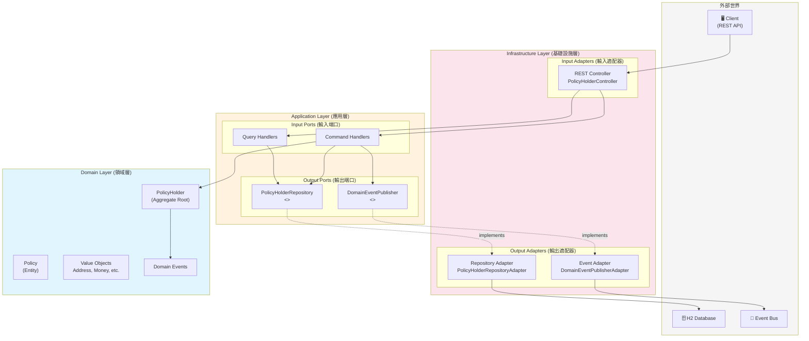

### 系統元件圖

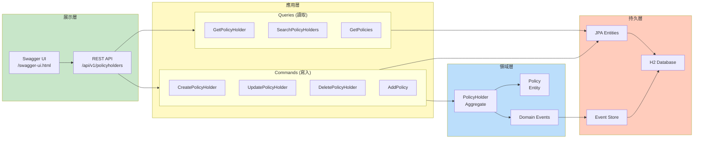

### CQRS 架構圖

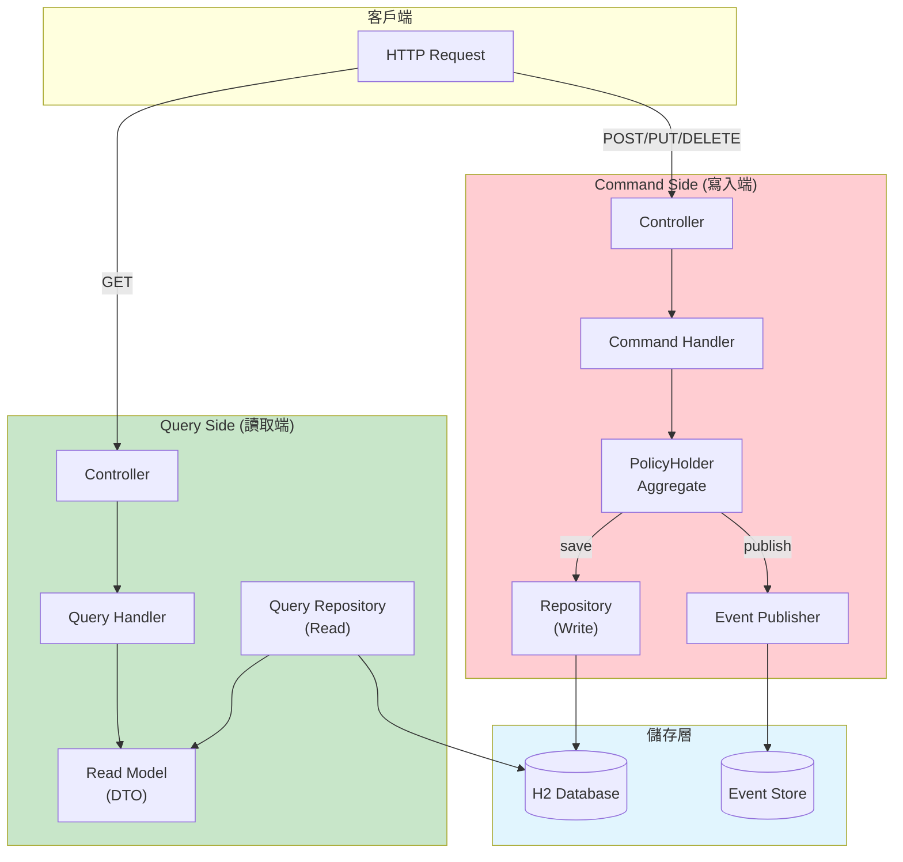

---

## 類別圖

### 領域層類別圖


### 應用層類別圖

```mermaid
classDiagram
    class CommandHandler~C, R~ {
        <<Interface>>
        +handle(C command) R
    }

    class QueryHandler~Q, R~ {
        <<Interface>>
        +handle(Q query) R
    }

    class CreatePolicyHolderCommandHandler {
        -PolicyHolderRepository repository
        -DomainEventPublisher eventPublisher
        +handle(CreatePolicyHolderCommand) PolicyHolderReadModel
    }

    class UpdatePolicyHolderCommandHandler {
        -PolicyHolderRepository repository
        -DomainEventPublisher eventPublisher
        +handle(UpdatePolicyHolderCommand) PolicyHolderReadModel
    }

    class DeletePolicyHolderCommandHandler {
        -PolicyHolderRepository repository
        -DomainEventPublisher eventPublisher
        +handle(DeletePolicyHolderCommand) void
    }

    class AddPolicyCommandHandler {
        -PolicyHolderRepository repository
        -DomainEventPublisher eventPublisher
        +handle(AddPolicyCommand) PolicyReadModel
    }

    class GetPolicyHolderQueryHandler {
        -PolicyHolderRepository repository
        +handle(GetPolicyHolderQuery) PolicyHolderReadModel
    }

    class SearchPolicyHoldersQueryHandler {
        -PolicyHolderQueryRepository queryRepository
        +handle(SearchPolicyHoldersQuery) PagedResult
    }

    class CreatePolicyHolderCommand {
        -String nationalId
        -String name
        -String gender
        -LocalDate birthDate
        -String mobilePhone
        -String email
        -AddressData address
    }

    class UpdatePolicyHolderCommand {
        -String policyHolderId
        -String mobilePhone
        -String email
        -AddressData address
    }

    class AddPolicyCommand {
        -String policyHolderId
        -String policyType
        -BigDecimal premium
        -BigDecimal sumInsured
        -LocalDate startDate
        -LocalDate endDate
    }

    class PolicyHolderReadModel {
        -String id
        -String nationalId
        -String name
        -String gender
        -LocalDate birthDate
        -String mobilePhone
        -String email
        -AddressReadModel address
        -String status
    }

    class PolicyReadModel {
        -String id
        -String policyHolderId
        -String policyType
        -BigDecimal premium
        -BigDecimal sumInsured
        -LocalDate startDate
        -LocalDate endDate
        -String status
    }

    class PolicyHolderRepository {
        <<Interface>>
        +save(PolicyHolder) PolicyHolder
        +findById(PolicyHolderId) Optional~PolicyHolder~
        +findByNationalId(NationalId) Optional~PolicyHolder~
        +existsByNationalId(NationalId) boolean
    }

    class PolicyHolderQueryRepository {
        <<Interface>>
        +findAll(Pageable) Page~PolicyHolderListItemReadModel~
        +searchByName(String, Pageable) Page~PolicyHolderListItemReadModel~
        +findByStatus(String, Pageable) Page~PolicyHolderListItemReadModel~
    }

    class DomainEventPublisher {
        <<Interface>>
        +publish(DomainEvent) void
        +publishAll(List~DomainEvent~) void
    }

    CommandHandler <|.. CreatePolicyHolderCommandHandler
    CommandHandler <|.. UpdatePolicyHolderCommandHandler
    CommandHandler <|.. DeletePolicyHolderCommandHandler
    CommandHandler <|.. AddPolicyCommandHandler

    QueryHandler <|.. GetPolicyHolderQueryHandler
    QueryHandler <|.. SearchPolicyHoldersQueryHandler

    CreatePolicyHolderCommandHandler ..> PolicyHolderRepository
    CreatePolicyHolderCommandHandler ..> DomainEventPublisher
    CreatePolicyHolderCommandHandler ..> CreatePolicyHolderCommand
    CreatePolicyHolderCommandHandler ..> PolicyHolderReadModel

    GetPolicyHolderQueryHandler ..> PolicyHolderRepository
    SearchPolicyHoldersQueryHandler ..> PolicyHolderQueryRepository
```

### 基礎設施層類別圖


---

## 時序圖

### 新增保戶時序圖

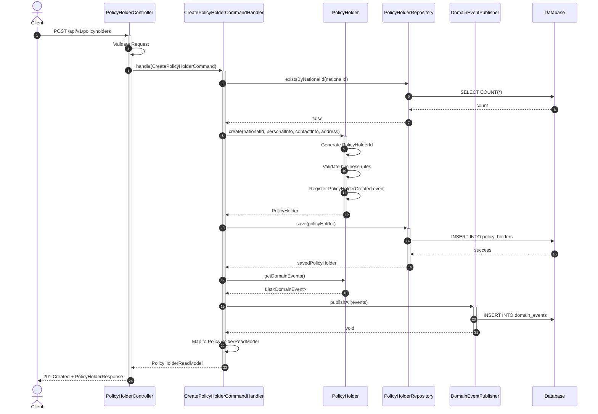

### 查詢保戶時序圖

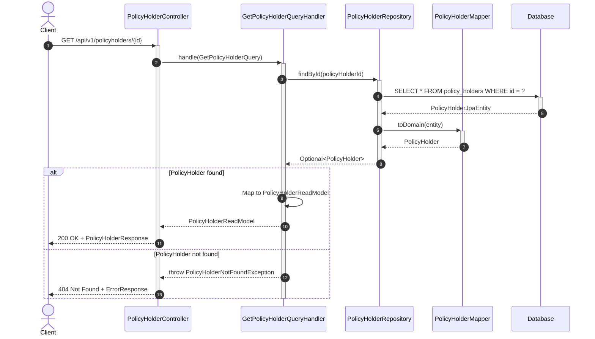

### 新增保單時序圖

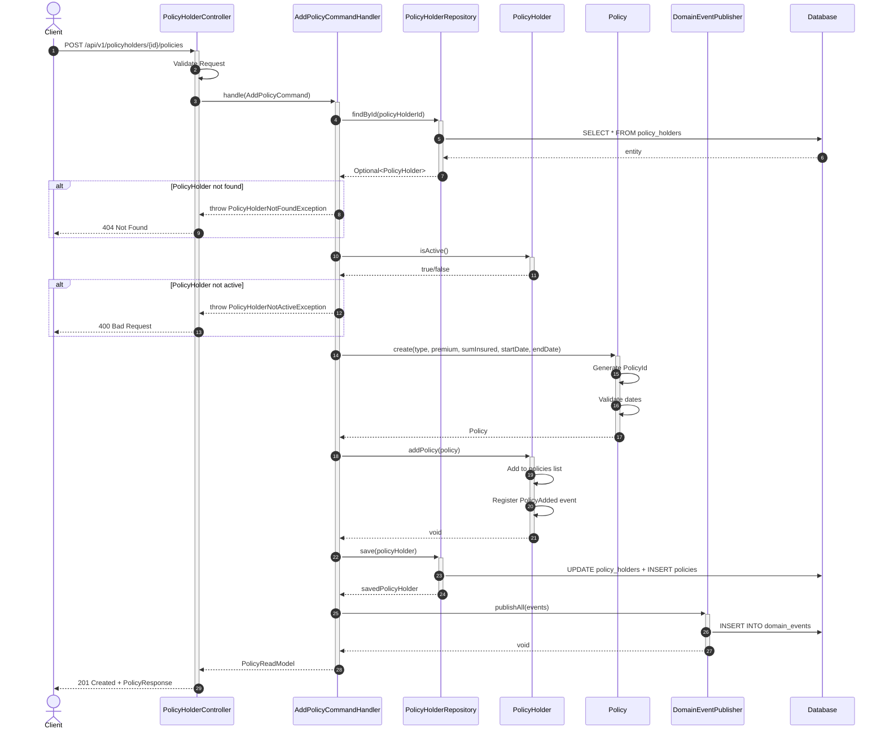

### 刪除保戶時序圖

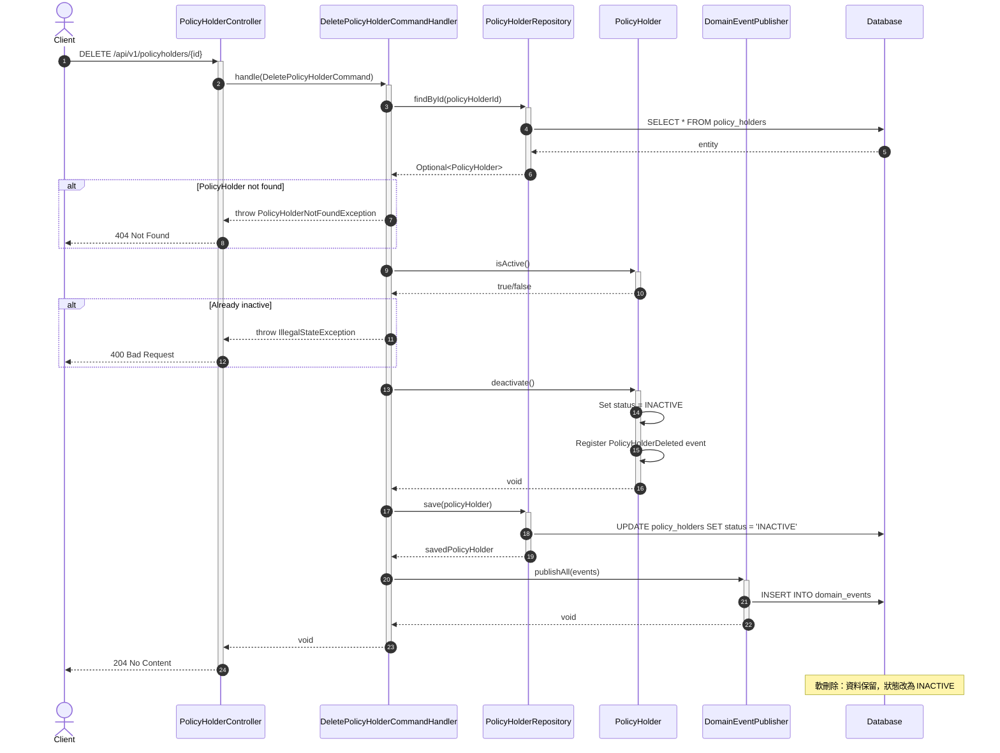

---

## ER Diagram

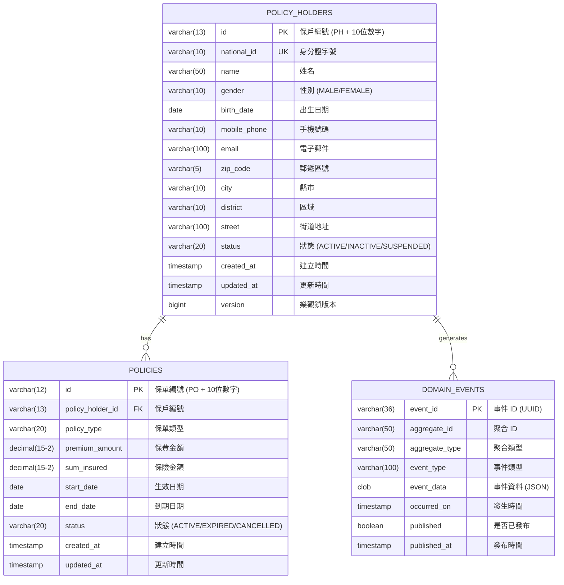

---

## 狀態圖

### 保戶狀態轉換

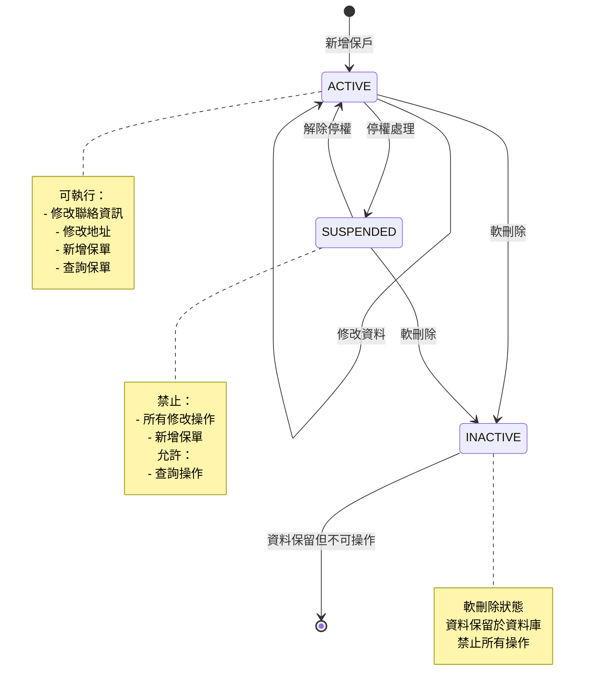

### 保單狀態轉換

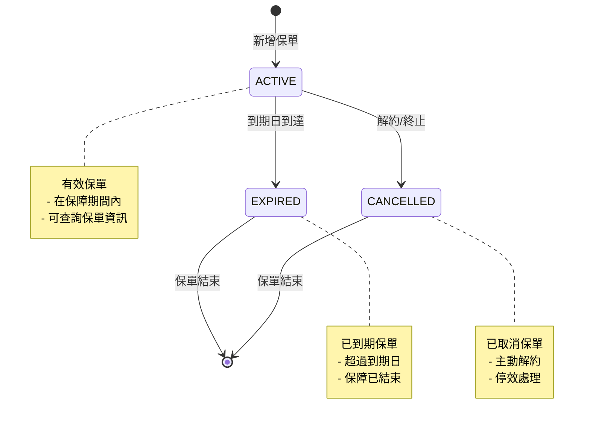

---

## 專案結構

```
src/main/java/com/insurance/policyholder/
│
├── domain/                          # 🔵 Domain Layer（最內層）
│   ├── model/
│   │   ├── aggregate/               # Aggregate Root
│   │   │   └── PolicyHolder.java
│   │   ├── entity/                  # Entity
│   │   │   └── Policy.java
│   │   ├── valueobject/             # Value Objects
│   │   │   ├── PolicyHolderId.java
│   │   │   ├── PolicyId.java
│   │   │   ├── NationalId.java
│   │   │   ├── PersonalInfo.java
│   │   │   ├── ContactInfo.java
│   │   │   ├── Address.java
│   │   │   └── Money.java
│   │   └── enums/                   # Domain Enums
│   ├── event/                       # Domain Events
│   ├── service/                     # Domain Services
│   └── exception/                   # Domain Exceptions
│
├── application/                     # 🟢 Application Layer
│   ├── command/                     # Commands (Write)
│   ├── commandhandler/              # Command Handlers
│   ├── query/                       # Queries (Read)
│   ├── queryhandler/                # Query Handlers
│   ├── readmodel/                   # Read Models (DTOs)
│   └── port/
│       ├── input/                   # Input Ports
│       └── output/                  # Output Ports
│
└── infrastructure/                  # 🟠 Infrastructure Layer（最外層）
    ├── adapter/
    │   ├── input/rest/              # REST API Adapter
    │   └── output/
    │       ├── persistence/         # JPA Adapter
    │       └── event/               # Event Store Adapter
    ├── config/                      # Spring Configurations
    └── exception/                   # Global Exception Handler
```

---

## API 端點

### 保戶管理 API

| Method | Endpoint | 說明 |
|--------|----------|------|
| `POST` | `/api/v1/policyholders` | 新增保戶 |
| `GET` | `/api/v1/policyholders/{id}` | 依 ID 查詢保戶 |
| `GET` | `/api/v1/policyholders/national-id/{nationalId}` | 依身分證字號查詢 |
| `GET` | `/api/v1/policyholders` | 搜尋保戶（支援分頁、篩選） |
| `PUT` | `/api/v1/policyholders/{id}` | 修改保戶聯絡資訊 |
| `DELETE` | `/api/v1/policyholders/{id}` | 軟刪除保戶 |

### 保單管理 API

| Method | Endpoint | 說明 |
|--------|----------|------|
| `POST` | `/api/v1/policyholders/{id}/policies` | 新增保單 |
| `GET` | `/api/v1/policyholders/{id}/policies` | 查詢保戶所有保單 |
| `GET` | `/api/v1/policyholders/{id}/policies/{policyId}` | 查詢單一保單 |

---

## 快速開始

### 前置需求

- JDK 17+
- Gradle 8+

### 建置與執行

```bash
# Clone 專案
git clone <repository-url>
cd insurance_management_architecture_demo

# 建置專案
gradle build

# 執行測試
gradle test

# 啟動應用程式
gradle bootRun
```

### 存取服務

| 服務 | URL |
|------|-----|
| API Base URL | http://localhost:8080/api/v1 |
| Swagger UI | http://localhost:8080/swagger-ui.html |
| OpenAPI Docs | http://localhost:8080/api-docs |
| H2 Console | http://localhost:8080/h2-console |

---

## 測試

### 測試統計

| 類型 | 數量 |
|------|------|
| 單元測試 | 177 |
| 整合測試 | 16 |
| 架構測試 | 16 |
| **總計** | **209** |

### 覆蓋率

| 指標 | 數值 |
|------|------|
| 指令覆蓋率 | 81% |
| 分支覆蓋率 | 65% |

### 執行測試

```bash
# 執行所有測試
gradle test

# 執行架構測試
gradle test --tests "*ArchitectureTest*"

# 產生覆蓋率報告
gradle test jacocoTestReport
```

---

## 錯誤代碼

| 錯誤代碼 | HTTP Status | 說明 |
|----------|-------------|------|
| `POLICY_HOLDER_NOT_FOUND` | 404 | 保戶不存在 |
| `POLICY_NOT_FOUND` | 404 | 保單不存在 |
| `POLICY_HOLDER_NOT_ACTIVE` | 400 | 保戶非活動狀態 |
| `VALIDATION_ERROR` | 400 | 輸入驗證錯誤 |
| `INVALID_ARGUMENT` | 400 | 非法參數 |
| `INTERNAL_ERROR` | 500 | 系統內部錯誤 |

---

## 授權

本專案採用 MIT 授權 - 詳見 [LICENSE](LICENSE) 檔案

---

## 貢獻者

Built with Claude Opus 4.5
