# 保戶基本資料管理系統 (PolicyHolder Management System)

[](https://openjdk.java.net/)
[](https://spring.io/projects/spring-boot)
[]()
[]()
[](LICENSE)

人壽保險保戶基本資料管理系統，提供保戶與保單的完整生命週期管理。

---

## 目錄

- [專案概述](#專案概述)
- [架構原理詳細說明](#架構原理詳細說明)
  - [SOLID 原則](#solid-原則)
  - [CQRS 模式](#cqrs-模式-command-query-responsibility-segregation)
  - [Event Store 模式](#event-store-模式)
  - [BDD 測試方法論](#bdd-測試方法論-behavior-driven-development)
- [架構設計圖](#架構設計圖)
  - [六角形架構圖](#六角形架構圖)
  - [系統元件圖](#系統元件圖)
  - [CQRS 架構圖](#cqrs-架構圖)
- [類別圖](#類別圖)
  - [領域層類別圖](#領域層類別圖)
  - [應用層類別圖](#應用層類別圖)
  - [基礎設施層類別圖](#基礎設施層類別圖)
- [時序圖](#時序圖)
  - [新增保戶時序圖](#新增保戶時序圖)
  - [查詢保戶時序圖](#查詢保戶時序圖)
  - [新增保單時序圖](#新增保單時序圖)
  - [刪除保戶時序圖](#刪除保戶時序圖)
- [ER Diagram](#er-diagram)
- [狀態圖](#狀態圖)
- [專案結構](#專案結構)
- [API 端點](#api-端點)
- [快速開始](#快速開始)
- [DDD 戰略與戰術設計模式](#ddd-戰略與戰術設計模式)
  - [Strategic Design (戰略設計)](#strategic-design-戰略設計)
  - [Tactical Design (戰術設計)](#tactical-design-戰術設計)
- [GoF 設計模式與架構模式](#gof-設計模式與架構模式)
  - [Creational Patterns (創建型模式)](#creational-patterns-創建型模式)
  - [Structural Patterns (結構型模式)](#structural-patterns-結構型模式)
  - [Behavioral Patterns (行為型模式)](#behavioral-patterns-行為型模式)
  - [Architectural Patterns (架構模式)](#architectural-patterns-架構模式)

---

## 專案概述

本系統是一個基於 **Domain-Driven Design (DDD)** 設計的企業級應用程式，採用 **六角形架構 (Hexagonal Architecture)** 與 **CQRS Level 2** 模式，提供符合 **OpenAPI 3.0** 規範的 RESTful API。

### 已實作功能 (User Stories)

| User Story | 功能 | API | 狀態 |
|------------|------|-----|------|
| US1 | 新增保戶資料 | `POST /api/v1/policyholders` | ✅ |
| US2 | 查詢保戶資料 | `GET /api/v1/policyholders/{id}` | ✅ |
| US3 | 修改保戶資料 | `PUT /api/v1/policyholders/{id}` | ✅ |
| US4 | 刪除保戶資料 | `DELETE /api/v1/policyholders/{id}` | ✅ |
| US5 | 新增保單 | `POST /api/v1/policyholders/{id}/policies` | ✅ |
| US6 | 查詢保單 | `GET /api/v1/policyholders/{id}/policies` | ✅ |

### 技術亮點

- ✅ Domain-Driven Design 戰術設計模式
- ✅ 六角形架構（端口與適配器）
- ✅ CQRS Level 2（讀寫模型分離）
- ✅ 領域事件持久化 (Event Store)
- ✅ SOLID 原則
- ✅ ArchUnit 架構測試
- ✅ TDD/BDD 測試驅動開發
- ✅ 台灣身分證字號驗證

---

## 架構原理詳細說明

### SOLID 原則

本專案嚴格遵循 **SOLID** 五大設計原則，確保程式碼的可維護性、可擴展性與可測試性。

#### 1. 單一職責原則 (Single Responsibility Principle, SRP)

> 一個類別應該只有一個引起它變化的原因。

**專案實踐:**

```
✅ Command Handler 只負責處理單一命令
   └── CreatePolicyHolderCommandHandler.java  → 只處理「建立保戶」
   └── UpdatePolicyHolderCommandHandler.java  → 只處理「更新保戶」
   └── DeletePolicyHolderCommandHandler.java  → 只處理「刪除保戶」

✅ Value Object 各自封裝特定的業務規則
   └── NationalId.java    → 只負責身分證字號驗證
   └── Money.java         → 只負責金額運算
   └── Address.java       → 只負責地址相關邏輯

✅ Mapper 只負責轉換
   └── PolicyHolderMapper.java  → Domain ↔ JPA Entity
   └── ResponseMapper.java      → Domain → Response DTO
```

**程式碼範例:**

```java
// ❌ 錯誤：一個類別做太多事情
public class PolicyHolderService {
    public void create(...) { /* 建立 */ }
    public void update(...) { /* 更新 */ }
    public void delete(...) { /* 刪除 */ }
    public void query(...) { /* 查詢 */ }
    public void validateNationalId(...) { /* 驗證 */ }
    public void sendEmail(...) { /* 發信 */ }
}

// ✅ 正確：每個類別只有單一職責
public class CreatePolicyHolderCommandHandler {
    public PolicyHolderReadModel handle(CreatePolicyHolderCommand command) {
        // 只負責建立保戶的業務邏輯
    }
}
```

#### 2. 開放封閉原則 (Open/Closed Principle, OCP)

> 軟體實體應該對擴展開放，對修改封閉。

**專案實踐:**

```
✅ 使用介面定義 Port，新增實作不需修改既有程式碼
   └── PolicyHolderRepository (interface)
       ├── PolicyHolderRepositoryAdapter (JPA 實作)
       └── 未來可新增: PolicyHolderRedisAdapter (快取實作)

✅ 領域事件可擴展而不修改 Aggregate
   └── DomainEvent (abstract)
       ├── PolicyHolderCreated
       ├── PolicyHolderUpdated
       ├── PolicyHolderDeleted
       └── PolicyAdded
```

**程式碼範例:**

```java
// 介面定義（封閉）
public interface PolicyHolderRepository {
    PolicyHolder save(PolicyHolder policyHolder);
    Optional<PolicyHolder> findById(PolicyHolderId id);
}

// 新增實作（開放）- 不修改既有程式碼
@Component
public class PolicyHolderJpaAdapter implements PolicyHolderRepository {
    // JPA 實作
}

// 未來可新增 Redis 實作
@Component
@Profile("cache")
public class PolicyHolderCacheAdapter implements PolicyHolderRepository {
    // Redis 實作 - 完全不影響既有程式碼
}
```

#### 3. 里氏替換原則 (Liskov Substitution Principle, LSP)

> 子類別必須能夠替換其基底類別。

**專案實踐:**

```
✅ 所有 DomainEvent 子類別都能被 DomainEventPublisher 處理
   └── DomainEventPublisher.publish(DomainEvent event)
       └── 可接受任何 DomainEvent 子類別

✅ Repository 介面的任何實作都可以互換使用
   └── CommandHandler 依賴 PolicyHolderRepository 介面
       └── 無論是 JPA、MongoDB 或 Mock 實作都可以正常運作
```

**程式碼範例:**

```java
// 基底類別定義契約
public abstract class DomainEvent {
    public abstract String getEventType();
    public abstract String getAggregateId();
    public abstract LocalDateTime getOccurredOn();
}

// 子類別遵循契約
public class PolicyHolderCreated extends DomainEvent {
    @Override
    public String getEventType() { return "PolicyHolderCreated"; }
    // ... 完全符合基底類別的契約
}

// 使用端可以替換任何子類別
public void publishAll(List<DomainEvent> events) {
    events.forEach(this::publish);  // 任何 DomainEvent 子類別都能正常運作
}
```

#### 4. 介面隔離原則 (Interface Segregation Principle, ISP)

> 客戶端不應該被強迫依賴它不使用的方法。

**專案實踐:**

```
✅ 讀寫分離的 Repository 介面
   └── PolicyHolderRepository      → 寫入操作 (save, findById)
   └── PolicyHolderQueryRepository → 讀取操作 (search, findAll)

✅ 細粒度的 Handler 介面
   └── CommandHandler<C, R>  → 只定義 handle 方法
   └── QueryHandler<Q, R>    → 只定義 handle 方法
```

**程式碼範例:**

```java
// ❌ 錯誤：大而全的介面
public interface PolicyHolderRepository {
    void save(...);
    void delete(...);
    PolicyHolder findById(...);
    Page<PolicyHolder> findAll(...);
    Page<PolicyHolder> searchByName(...);
    long count();
    // ... 更多方法
}

// ✅ 正確：細粒度的介面
public interface PolicyHolderRepository {       // 寫入端使用
    PolicyHolder save(PolicyHolder policyHolder);
    Optional<PolicyHolder> findById(PolicyHolderId id);
}

public interface PolicyHolderQueryRepository {  // 讀取端使用
    Page<PolicyHolderListItemReadModel> findAll(Pageable pageable);
    Page<PolicyHolderListItemReadModel> searchByName(String name, Pageable pageable);
}
```

#### 5. 依賴反轉原則 (Dependency Inversion Principle, DIP)

> 高層模組不應該依賴低層模組，兩者都應該依賴抽象。

**專案實踐:**

```
✅ Application Layer 定義介面，Infrastructure Layer 實作
   └── Application Layer:
       └── PolicyHolderRepository (interface)    ← 定義 Port
       └── DomainEventPublisher (interface)      ← 定義 Port
   └── Infrastructure Layer:
       └── PolicyHolderRepositoryAdapter         → 實作 Port
       └── DomainEventPublisherAdapter           → 實作 Port

✅ 依賴注入方向
   └── Controller → Handler → Repository (interface) ← Adapter
```

**程式碼範例:**

```java
// Application Layer 定義抽象（高層模組）
public interface PolicyHolderRepository {
    PolicyHolder save(PolicyHolder policyHolder);
    Optional<PolicyHolder> findById(PolicyHolderId id);
}

// Application Layer 依賴抽象
@Service
public class CreatePolicyHolderCommandHandler {
    private final PolicyHolderRepository repository;  // 依賴介面，而非具體實作

    public CreatePolicyHolderCommandHandler(PolicyHolderRepository repository) {
        this.repository = repository;
    }
}

// Infrastructure Layer 實作抽象（低層模組）
@Component
public class PolicyHolderRepositoryAdapter implements PolicyHolderRepository {
    private final PolicyHolderJpaRepository jpaRepository;
    // 實作細節...
}
```

**SOLID 原則在各層的體現:**

```mermaid
graph TB
    subgraph "SOLID 在六角形架構的應用"
        subgraph DIP["依賴反轉 (DIP)"]
            AppLayer["Application Layer<br/>定義 Port 介面"]
            InfraLayer["Infrastructure Layer<br/>實作 Adapter"]
            AppLayer -.->|定義| Port["Port Interface"]
            InfraLayer -->|實作| Port
        end

        subgraph ISP["介面隔離 (ISP)"]
            WriteRepo["PolicyHolderRepository<br/>(寫入操作)"]
            ReadRepo["PolicyHolderQueryRepository<br/>(讀取操作)"]
        end

        subgraph SRP["單一職責 (SRP)"]
            CreateHandler["CreateHandler"]
            UpdateHandler["UpdateHandler"]
            DeleteHandler["DeleteHandler"]
        end

        subgraph OCP["開放封閉 (OCP)"]
            BaseEvent["DomainEvent"]
            Event1["PolicyHolderCreated"]
            Event2["PolicyHolderUpdated"]
            Event3["PolicyAdded"]
            BaseEvent --> Event1
            BaseEvent --> Event2
            BaseEvent --> Event3
        end
    end
```

---

### CQRS 模式 (Command Query Responsibility Segregation)

**CQRS** 是一種將讀取（Query）和寫入（Command）操作分離的架構模式。本專案採用 **CQRS Level 2**，即讀寫模型分離但共用資料庫。

#### CQRS 三個層級

| Level | 說明 | 本專案 |
|-------|------|--------|
| Level 1 | 程式碼層級分離 Command/Query | ✅ |
| Level 2 | 讀寫模型分離 (Read Model / Write Model) | ✅ |
| Level 3 | 讀寫資料庫分離 (最終一致性) | ❌ |

#### 專案中的 CQRS 實作

**Command Side (寫入端):**

```
POST /api/v1/policyholders
    │
    ▼
CreatePolicyHolderCommand
    │
    ▼
CreatePolicyHolderCommandHandler
    │
    ├── 1. 使用 Domain Model (PolicyHolder Aggregate)
    ├── 2. 執行業務邏輯驗證
    ├── 3. 產生 Domain Events
    └── 4. 透過 Repository 持久化
```

**Query Side (讀取端):**

```
GET /api/v1/policyholders/{id}
    │
    ▼
GetPolicyHolderQuery
    │
    ▼
GetPolicyHolderQueryHandler
    │
    └── 直接回傳 Read Model (PolicyHolderReadModel)
        無需載入完整 Aggregate
```

#### Command 與 Query 的差異

```java
// Command：改變系統狀態，不回傳查詢結果
public record CreatePolicyHolderCommand(
    String nationalId,
    String name,
    String gender,
    LocalDate birthDate,
    String mobilePhone,
    String email,
    AddressData address
) {}

// Command Handler：執行業務邏輯
@Service
public class CreatePolicyHolderCommandHandler {
    public PolicyHolderReadModel handle(CreatePolicyHolderCommand command) {
        // 1. 驗證業務規則
        // 2. 建立 Aggregate
        // 3. 持久化
        // 4. 發布事件
        // 5. 回傳 Read Model
    }
}

// Query：只讀取資料，不改變系統狀態
public record GetPolicyHolderQuery(String policyHolderId) {}

// Query Handler：單純讀取
@Service
public class GetPolicyHolderQueryHandler {
    public Optional<PolicyHolderReadModel> handle(GetPolicyHolderQuery query) {
        // 直接從 Repository 讀取並轉換為 Read Model
    }
}
```

#### Read Model 設計

```java
// Read Model：為查詢最佳化的 DTO
public class PolicyHolderReadModel {
    private String id;
    private String nationalId;
    private String name;
    private String maskedNationalId;  // 預先計算的遮罩值
    private String fullAddress;        // 預先組合的完整地址
    private int policyCount;           // 預先計算的保單數量
    // ... 為顯示最佳化的欄位
}

// Write Model：Domain Aggregate
public class PolicyHolder {
    private PolicyHolderId id;
    private NationalId nationalId;     // Value Object，含驗證邏輯
    private PersonalInfo personalInfo; // Value Object
    private ContactInfo contactInfo;   // Value Object
    private Address address;           // Value Object
    private List<Policy> policies;     // Entity Collection
    private List<DomainEvent> events;  // 領域事件
    // ... 完整的業務邏輯
}
```

#### CQRS 架構優勢

| 優勢 | 說明 |
|------|------|
| **效能優化** | 讀取可針對查詢最佳化，不受寫入模型限制 |
| **擴展性** | 讀寫可獨立擴展 |
| **簡化複雜度** | 寫入處理業務邏輯，讀取單純回傳資料 |
| **可測試性** | Command/Query Handler 可獨立測試 |


---

### Event Store 模式

**Event Store** 是一種將領域事件持久化的模式，用於記錄系統中所有狀態變化的歷史。

#### Event Store 的目的

| 用途 | 說明 |
|------|------|
| **審計追蹤** | 完整記錄所有業務操作的歷史 |
| **事件溯源** | 可重建任意時間點的系統狀態 |
| **事件驅動** | 支援非同步事件處理 |
| **除錯分析** | 追蹤問題發生的完整脈絡 |

#### 專案中的 Event Store 實作

**領域事件定義:**

```java
public abstract class DomainEvent {
    private final String eventId;         // 事件唯一識別碼
    private final String aggregateId;     // 聚合根 ID
    private final LocalDateTime occurredOn; // 發生時間

    public abstract String getEventType();
}

// 具體事件
public class PolicyHolderCreated extends DomainEvent {
    private final String policyHolderId;
    private final String nationalId;
    private final String name;
    private final String gender;
    private final LocalDate birthDate;
    private final String mobilePhone;
    private final String email;
    private final String fullAddress;
}

public class PolicyHolderUpdated extends DomainEvent {
    private final PolicyHolder updatedPolicyHolder;
}

public class PolicyAdded extends DomainEvent {
    private final String policyHolderId;
    private final Policy policy;
}
```

**Event Store 持久化:**

```java
@Entity
@Table(name = "domain_events")
public class DomainEventJpaEntity {
    @Id
    private String eventId;

    private String aggregateId;
    private String aggregateType;
    private String eventType;

    @Lob
    private String eventData;    // JSON 序列化的事件資料

    private LocalDateTime occurredOn;
    private boolean published;
    private LocalDateTime publishedAt;
}
```

**事件發布流程:**

```java
@Component
public class DomainEventPublisherAdapter implements DomainEventPublisher {
    private final EventStore eventStore;
    private final ApplicationEventPublisher springEventPublisher;

    @Override
    @Transactional
    public void publish(DomainEvent event) {
        // 1. 先持久化到 Event Store
        eventStore.save(event);

        // 2. 再發布到 Spring Event Bus
        springEventPublisher.publishEvent(event);
    }

    @Override
    public void publishAll(List<DomainEvent> events) {
        events.forEach(this::publish);
    }
}
```

#### Event Store 查詢能力

```java
public interface EventStore {
    // 儲存事件
    void save(DomainEvent event);
    void saveAll(List<DomainEvent> events);

    // 查詢事件
    List<DomainEvent> findByAggregateId(String aggregateId);
    List<DomainEvent> findByEventType(String eventType);
    List<DomainEvent> findByTimeRange(LocalDateTime start, LocalDateTime end);
}
```

#### Event Store 資料範例

```json
{
  "eventId": "550e8400-e29b-41d4-a716-446655440000",
  "aggregateId": "PH0000000001",
  "aggregateType": "PolicyHolder",
  "eventType": "PolicyHolderCreated",
  "eventData": {
    "policyHolderId": "PH0000000001",
    "nationalId": "A123456789",
    "name": "王小明",
    "gender": "MALE",
    "birthDate": "1990-01-15",
    "mobilePhone": "0912345678",
    "email": "wang@example.com",
    "fullAddress": "10001 台北市信義區測試路123號"
  },
  "occurredOn": "2024-01-15T10:30:00",
  "published": true,
  "publishedAt": "2024-01-15T10:30:01"
}
```

#### Event Store 架構圖

```mermaid
sequenceDiagram
    autonumber
    participant Handler as Command Handler
    participant Aggregate as PolicyHolder
    participant EventPub as Event Publisher
    participant EventStore as Event Store
    participant DB as Database
    participant EventBus as Spring Event Bus
    participant Listener as Event Listener

    Handler->>Aggregate: 執行業務操作
    Aggregate->>Aggregate: 產生 Domain Event
    Aggregate-->>Handler: 回傳含事件的 Aggregate

    Handler->>EventPub: publishAll(events)
    EventPub->>EventStore: save(event)
    EventStore->>DB: INSERT INTO domain_events
    DB-->>EventStore: success
    EventStore-->>EventPub: saved

    EventPub->>EventBus: publishEvent(event)
    EventBus->>Listener: onEvent(event)
    Listener-->>EventBus: handled
```

---

### BDD 測試方法論 (Behavior-Driven Development)

**BDD** 是一種以行為為導向的開發方法論，強調使用自然語言描述系統行為，讓開發人員、測試人員和業務人員能夠共同理解需求。

#### BDD 核心概念

| 概念 | 說明 |
|------|------|
| **Given** | 前置條件：系統的初始狀態 |
| **When** | 觸發動作：執行的操作 |
| **Then** | 預期結果：驗證的行為 |

#### 專案中的 BDD 測試風格

**Domain Layer 測試:**

```java
@DisplayName("PolicyHolder Tests")
class PolicyHolderTest {

    @Nested
    @DisplayName("建立保戶")
    class CreatePolicyHolder {

        @Test
        @DisplayName("should create policy holder with valid data")
        void shouldCreatePolicyHolderWithValidData() {
            // Given: 有效的保戶資料
            NationalId nationalId = NationalId.of("A123456789");
            PersonalInfo personalInfo = PersonalInfo.of("王小明", Gender.MALE,
                LocalDate.of(1990, 1, 15));
            ContactInfo contactInfo = ContactInfo.of("0912345678", "wang@example.com");
            Address address = Address.of("10001", "台北市", "信義區", "測試路123號");

            // When: 建立保戶
            PolicyHolder policyHolder = PolicyHolder.create(
                nationalId, personalInfo, contactInfo, address
            );

            // Then: 保戶應該被正確建立
            assertNotNull(policyHolder.getId());
            assertEquals("A123456789", policyHolder.getNationalId().getValue());
            assertEquals(PolicyHolderStatus.ACTIVE, policyHolder.getStatus());

            // And: 應該產生建立事件
            List<DomainEvent> events = policyHolder.getDomainEvents();
            assertEquals(1, events.size());
            assertInstanceOf(PolicyHolderCreated.class, events.get(0));
        }

        @Test
        @DisplayName("should reject invalid national ID")
        void shouldRejectInvalidNationalId() {
            // Given: 無效的身分證字號
            String invalidNationalId = "A123456780";  // 檢查碼錯誤

            // When & Then: 應該拋出驗證例外
            assertThrows(InvalidNationalIdException.class, () ->
                NationalId.of(invalidNationalId)
            );
        }
    }

    @Nested
    @DisplayName("新增保單")
    class AddPolicy {

        @Test
        @DisplayName("should add policy to active policy holder")
        void shouldAddPolicyToActivePolicyHolder() {
            // Given: 一個活動中的保戶
            PolicyHolder policyHolder = createActivePolicyHolder();
            policyHolder.clearEvents();

            // And: 一份有效的保單
            Policy policy = Policy.create(
                PolicyType.LIFE,
                Money.twd(10000),
                Money.twd(1000000),
                LocalDate.now(),
                LocalDate.now().plusYears(1)
            );

            // When: 新增保單
            policyHolder.addPolicy(policy);

            // Then: 保單應該被加入
            assertEquals(1, policyHolder.getPolicies().size());

            // And: 應該產生 PolicyAdded 事件
            List<DomainEvent> events = policyHolder.getDomainEvents();
            assertEquals(1, events.size());
            assertInstanceOf(PolicyAdded.class, events.get(0));
        }

        @Test
        @DisplayName("should not add policy to inactive policy holder")
        void shouldNotAddPolicyToInactivePolicyHolder() {
            // Given: 一個停用的保戶
            PolicyHolder policyHolder = createInactivePolicyHolder();
            Policy policy = createValidPolicy();

            // When & Then: 應該拋出業務例外
            assertThrows(PolicyHolderNotActiveException.class, () ->
                policyHolder.addPolicy(policy)
            );
        }
    }
}
```

**Application Layer 測試:**

```java
@DisplayName("CreatePolicyHolderCommandHandler Tests")
class CreatePolicyHolderCommandHandlerTest {

    @Nested
    @DisplayName("成功建立保戶")
    class SuccessfulCreation {

        @Test
        @DisplayName("should create policy holder and publish events")
        void shouldCreatePolicyHolderAndPublishEvents() {
            // Given: 有效的建立命令
            CreatePolicyHolderCommand command = new CreatePolicyHolderCommand(
                "A123456789", "王小明", "MALE",
                LocalDate.of(1990, 1, 15),
                "0912345678", "wang@example.com",
                new AddressData("10001", "台北市", "信義區", "測試路123號")
            );

            // And: Repository 回傳身分證字號不存在
            when(repository.existsByNationalId(any())).thenReturn(false);
            when(repository.save(any())).thenAnswer(i -> i.getArgument(0));

            // When: 執行建立命令
            PolicyHolderReadModel result = handler.handle(command);

            // Then: 保戶應該被儲存
            verify(repository).save(any(PolicyHolder.class));

            // And: 事件應該被發布
            verify(eventPublisher).publishAll(anyList());

            // And: 回傳正確的 Read Model
            assertNotNull(result.getId());
            assertEquals("王小明", result.getName());
        }
    }

    @Nested
    @DisplayName("建立失敗情況")
    class FailureScenarios {

        @Test
        @DisplayName("should reject duplicate national ID")
        void shouldRejectDuplicateNationalId() {
            // Given: 身分證字號已存在
            when(repository.existsByNationalId(any())).thenReturn(true);

            // When & Then: 應該拋出重複例外
            assertThrows(DuplicateNationalIdException.class, () ->
                handler.handle(validCommand)
            );

            // And: 不應該儲存或發布事件
            verify(repository, never()).save(any());
            verify(eventPublisher, never()).publishAll(any());
        }
    }
}
```

**Integration Test (BDD 風格):**

```java
@SpringBootTest
@AutoConfigureMockMvc
@DisplayName("PolicyHolder API Integration Tests")
class PolicyHolderIntegrationTest {

    @Nested
    @DisplayName("新增保戶 API")
    class CreatePolicyHolderApi {

        @Test
        @DisplayName("完整的保戶建立流程")
        void completePolicyHolderCreationFlow() throws Exception {
            // Given: 一個有效的建立保戶請求
            String request = """
                {
                    "nationalId": "A123456789",
                    "name": "王小明",
                    "gender": "MALE",
                    "birthDate": "1990-01-15",
                    "mobilePhone": "0912345678",
                    "email": "wang@example.com",
                    "address": {
                        "zipCode": "10001",
                        "city": "台北市",
                        "district": "信義區",
                        "street": "測試路123號"
                    }
                }
                """;

            // When: 發送 POST 請求
            MvcResult result = mockMvc.perform(post("/api/v1/policyholders")
                    .contentType(MediaType.APPLICATION_JSON)
                    .content(request))
                // Then: 應該回傳 201 Created
                .andExpect(status().isCreated())
                .andExpect(jsonPath("$.success").value(true))
                .andExpect(jsonPath("$.data.id").exists())
                .andExpect(jsonPath("$.data.name").value("王小明"))
                .andReturn();

            // And: 應該可以查詢到該保戶
            String policyHolderId = JsonPath.read(
                result.getResponse().getContentAsString(),
                "$.data.id"
            );

            mockMvc.perform(get("/api/v1/policyholders/{id}", policyHolderId))
                .andExpect(status().isOk())
                .andExpect(jsonPath("$.data.nationalId").value("A123456789"));

            // And: 事件應該被記錄到 Event Store
            List<DomainEventJpaEntity> events = eventRepository
                .findByAggregateIdOrderByOccurredOnAsc(policyHolderId);
            assertEquals(1, events.size());
            assertEquals("PolicyHolderCreated", events.get(0).getEventType());
        }
    }
}
```

#### 測試命名慣例

本專案採用描述性的測試命名，讓測試本身成為文件：

```java
// 使用 @DisplayName 提供中文描述
@DisplayName("保戶管理功能測試")
class PolicyHolderTest {

    // 使用巢狀類別組織相關測試
    @Nested
    @DisplayName("建立保戶")
    class CreatePolicyHolder {

        // 測試方法命名：should + 預期行為 + 條件
        @Test
        @DisplayName("應該成功建立具有有效資料的保戶")
        void shouldCreatePolicyHolderWithValidData() { }

        @Test
        @DisplayName("應該拒絕無效的身分證字號")
        void shouldRejectInvalidNationalId() { }

        @Test
        @DisplayName("應該拒絕重複的身分證字號")
        void shouldRejectDuplicateNationalId() { }
    }
}
```

#### BDD 測試金字塔

```mermaid
graph TB
    subgraph "測試金字塔"
        E2E["🔺 End-to-End Tests<br/>整合測試 (16)"]
        Integration["🔸 Integration Tests<br/>API 測試 (40)"]
        Unit["🟢 Unit Tests<br/>單元測試 (493)"]
    end

    E2E --> Integration
    Integration --> Unit

    style E2E fill:#ff6b6b
    style Integration fill:#feca57
    style Unit fill:#1dd1a1
```

---

## 架構設計圖

### 六角形架構圖

```mermaid
graph TB
    subgraph External["外部世界"]
        Client["🖥️ Client<br/>(REST API)"]
        DB["🗄️ H2 Database"]
        EventBus["📨 Event Bus"]
    end

    subgraph Infrastructure["Infrastructure Layer (基礎設施層)"]
        subgraph InputAdapters["Input Adapters (輸入適配器)"]
            RestController["REST Controller<br/>PolicyHolderController"]
        end

        subgraph OutputAdapters["Output Adapters (輸出適配器)"]
            RepoAdapter["Repository Adapter<br/>PolicyHolderRepositoryAdapter"]
            EventAdapter["Event Adapter<br/>DomainEventPublisherAdapter"]
        end
    end

    subgraph Application["Application Layer (應用層)"]
        subgraph InputPorts["Input Ports (輸入端口)"]
            CmdHandler["Command Handlers"]
            QryHandler["Query Handlers"]
        end

        subgraph OutputPorts["Output Ports (輸出端口)"]
            RepoPort["PolicyHolderRepository<br/><<interface>>"]
            EventPort["DomainEventPublisher<br/><<interface>>"]
        end
    end

    subgraph Domain["Domain Layer (領域層)"]
        Aggregate["PolicyHolder<br/>(Aggregate Root)"]
        Entity["Policy<br/>(Entity)"]
        ValueObj["Value Objects<br/>Address, Money, etc."]
        DomainEvent["Domain Events"]
    end

    Client --> RestController
    RestController --> CmdHandler
    RestController --> QryHandler

    CmdHandler --> Aggregate
    QryHandler --> RepoPort
    Aggregate --> DomainEvent

    CmdHandler --> RepoPort
    CmdHandler --> EventPort

    RepoPort -.->|implements| RepoAdapter
    EventPort -.->|implements| EventAdapter

    RepoAdapter --> DB
    EventAdapter --> EventBus

    style Domain fill:#e1f5fe
    style Application fill:#fff3e0
    style Infrastructure fill:#fce4ec
    style External fill:#f5f5f5
```

### 系統元件圖


### CQRS 架構圖


---

## 類別圖

### 領域層類別圖


### 應用層類別圖


### 基礎設施層類別圖


---

## 時序圖

### 新增保戶時序圖


### 查詢保戶時序圖


### 新增保單時序圖


### 刪除保戶時序圖

```mermaid
sequenceDiagram
    autonumber
    actor Client
    participant Controller as PolicyHolderController
    participant Handler as DeletePolicyHolderCommandHandler
    participant Repo as PolicyHolderRepository
    participant Aggregate as PolicyHolder
    participant EventPub as DomainEventPublisher
    participant DB as Database

    Client->>+Controller: DELETE /api/v1/policyholders/{id}
    Controller->>+Handler: handle(DeletePolicyHolderCommand)

    Handler->>+Repo: findById(policyHolderId)
    Repo->>DB: SELECT * FROM policy_holders
    DB-->>Repo: entity
    Repo-->>-Handler: Optional<PolicyHolder>

    alt PolicyHolder not found
        Handler-->>Controller: throw PolicyHolderNotFoundException
        Controller-->>Client: 404 Not Found
    end

    Handler->>+Aggregate: isActive()
    Aggregate-->>-Handler: true/false

    alt Already inactive
        Handler-->>Controller: throw IllegalStateException
        Controller-->>Client: 400 Bad Request
    end

    Handler->>+Aggregate: deactivate()
    Aggregate->>Aggregate: Set status = INACTIVE
    Aggregate->>Aggregate: Register PolicyHolderDeleted event
    Aggregate-->>-Handler: void

    Handler->>+Repo: save(policyHolder)
    Repo->>DB: UPDATE policy_holders SET status = 'INACTIVE'
    Repo-->>-Handler: savedPolicyHolder

    Handler->>+EventPub: publishAll(events)
    EventPub->>DB: INSERT INTO domain_events
    EventPub-->>-Handler: void

    Handler-->>-Controller: void
    Controller-->>-Client: 204 No Content

    Note over DB: 軟刪除：資料保留，狀態改為 INACTIVE
```

---

## ER Diagram

```mermaid
erDiagram
    POLICY_HOLDERS {
        varchar(13) id PK "保戶編號 (PH + 10位數字)"
        varchar(10) national_id UK "身分證字號"
        varchar(50) name "姓名"
        varchar(10) gender "性別 (MALE/FEMALE)"
        date birth_date "出生日期"
        varchar(10) mobile_phone "手機號碼"
        varchar(100) email "電子郵件"
        varchar(5) zip_code "郵遞區號"
        varchar(10) city "縣市"
        varchar(10) district "區域"
        varchar(100) street "街道地址"
        varchar(20) status "狀態 (ACTIVE/INACTIVE/SUSPENDED)"
        timestamp created_at "建立時間"
        timestamp updated_at "更新時間"
        bigint version "樂觀鎖版本"
    }

    POLICIES {
        varchar(12) id PK "保單編號 (PO + 10位數字)"
        varchar(13) policy_holder_id FK "保戶編號"
        varchar(20) policy_type "保單類型"
        decimal(15-2) premium_amount "保費金額"
        decimal(15-2) sum_insured "保險金額"
        date start_date "生效日期"
        date end_date "到期日期"
        varchar(20) status "狀態 (ACTIVE/EXPIRED/CANCELLED)"
        timestamp created_at "建立時間"
        timestamp updated_at "更新時間"
    }

    DOMAIN_EVENTS {
        varchar(36) event_id PK "事件 ID (UUID)"
        varchar(50) aggregate_id "聚合 ID"
        varchar(50) aggregate_type "聚合類型"
        varchar(100) event_type "事件類型"
        clob event_data "事件資料 (JSON)"
        timestamp occurred_on "發生時間"
        boolean published "是否已發布"
        timestamp published_at "發布時間"
    }

    POLICY_HOLDERS ||--o{ POLICIES : "has"
    POLICY_HOLDERS ||--o{ DOMAIN_EVENTS : "generates"
```

---

## 狀態圖

### 保戶狀態轉換

```mermaid
stateDiagram-v2
    [*] --> ACTIVE: 新增保戶

    ACTIVE --> ACTIVE: 修改資料
    ACTIVE --> INACTIVE: 軟刪除
    ACTIVE --> SUSPENDED: 停權處理

    SUSPENDED --> ACTIVE: 解除停權
    SUSPENDED --> INACTIVE: 軟刪除

    INACTIVE --> [*]: 資料保留但不可操作

    note right of ACTIVE
        可執行：
        - 修改聯絡資訊
        - 修改地址
        - 新增保單
        - 查詢保單
    end note

    note right of SUSPENDED
        禁止：
        - 所有修改操作
        - 新增保單
        允許：
        - 查詢操作
    end note

    note right of INACTIVE
        軟刪除狀態
        資料保留於資料庫
        禁止所有操作
    end note
```

### 保單狀態轉換

```mermaid
stateDiagram-v2
    [*] --> ACTIVE: 新增保單

    ACTIVE --> EXPIRED: 到期日到達
    ACTIVE --> CANCELLED: 解約/終止

    EXPIRED --> [*]: 保單結束
    CANCELLED --> [*]: 保單結束

    note right of ACTIVE
        有效保單
        - 在保障期間內
        - 可查詢保單資訊
    end note

    note right of EXPIRED
        已到期保單
        - 超過到期日
        - 保障已結束
    end note

    note right of CANCELLED
        已取消保單
        - 主動解約
        - 停效處理
    end note
```

---

## 專案結構

```
src/main/java/com/insurance/policyholder/
│
├── domain/                          # 🔵 Domain Layer（最內層）
│   ├── model/
│   │   ├── aggregate/               # Aggregate Root
│   │   │   └── PolicyHolder.java
│   │   ├── entity/                  # Entity
│   │   │   └── Policy.java
│   │   ├── valueobject/             # Value Objects
│   │   │   ├── PolicyHolderId.java
│   │   │   ├── PolicyId.java
│   │   │   ├── NationalId.java
│   │   │   ├── PersonalInfo.java
│   │   │   ├── ContactInfo.java
│   │   │   ├── Address.java
│   │   │   └── Money.java
│   │   └── enums/                   # Domain Enums
│   ├── event/                       # Domain Events
│   ├── service/                     # Domain Services
│   └── exception/                   # Domain Exceptions
│
├── application/                     # 🟢 Application Layer
│   ├── command/                     # Commands (Write)
│   ├── commandhandler/              # Command Handlers
│   ├── query/                       # Queries (Read)
│   ├── queryhandler/                # Query Handlers
│   ├── readmodel/                   # Read Models (DTOs)
│   └── port/
│       ├── input/                   # Input Ports
│       └── output/                  # Output Ports
│
└── infrastructure/                  # 🟠 Infrastructure Layer（最外層）
    ├── adapter/
    │   ├── input/rest/              # REST API Adapter
    │   └── output/
    │       ├── persistence/         # JPA Adapter
    │       └── event/               # Event Store Adapter
    ├── config/                      # Spring Configurations
    └── exception/                   # Global Exception Handler
```

---

## API 端點

### 保戶管理 API

| Method | Endpoint | 說明 |
|--------|----------|------|
| `POST` | `/api/v1/policyholders` | 新增保戶 |
| `GET` | `/api/v1/policyholders/{id}` | 依 ID 查詢保戶 |
| `GET` | `/api/v1/policyholders/national-id/{nationalId}` | 依身分證字號查詢 |
| `GET` | `/api/v1/policyholders` | 搜尋保戶（支援分頁、篩選） |
| `PUT` | `/api/v1/policyholders/{id}` | 修改保戶聯絡資訊 |
| `DELETE` | `/api/v1/policyholders/{id}` | 軟刪除保戶 |

### 保單管理 API

| Method | Endpoint | 說明 |
|--------|----------|------|
| `POST` | `/api/v1/policyholders/{id}/policies` | 新增保單 |
| `GET` | `/api/v1/policyholders/{id}/policies` | 查詢保戶所有保單 |
| `GET` | `/api/v1/policyholders/{id}/policies/{policyId}` | 查詢單一保單 |

---

## 快速開始

### 前置需求

- JDK 17+
- Gradle 8+

### 建置與執行

```bash
# Clone 專案
git clone <repository-url>
cd insurance_management_architecture_demo

# 建置專案
gradle build

# 執行測試
gradle test

# 啟動應用程式
gradle bootRun
```

### 存取服務

| 服務 | URL |
|------|-----|
| API Base URL | http://localhost:8080/api/v1 |
| Swagger UI | http://localhost:8080/swagger-ui.html |
| OpenAPI Docs | http://localhost:8080/api-docs |
| H2 Console | http://localhost:8080/h2-console |

---

## Swagger / OpenAPI 文件

本專案使用 **SpringDoc OpenAPI** 提供完整的 API 文件與互動式測試介面。

### Swagger UI 使用說明

啟動應用程式後，開啟瀏覽器訪問：

```
http://localhost:8080/swagger-ui.html
```

### API 文件結構

```yaml
openapi: 3.0.1
info:
  title: PolicyHolder Management API
  description: 保戶基本資料管理系統 API
  version: v1

servers:
  - url: http://localhost:8080
    description: Local Development Server

paths:
  /api/v1/policyholders:
    post: 建立新保戶
    get: 搜尋保戶列表
  /api/v1/policyholders/{id}:
    get: 查詢保戶詳情
    put: 更新保戶資料
    delete: 刪除保戶
  /api/v1/policyholders/{id}/policies:
    post: 新增保單
    get: 查詢保戶保單列表
```

### OpenAPI 端點

| 端點 | 說明 |
|------|------|
| `/api-docs` | JSON 格式 OpenAPI 規格文件 |
| `/api-docs.yaml` | YAML 格式 OpenAPI 規格文件 |
| `/swagger-ui.html` | Swagger UI 互動式文件 |

---

### API 測試案例 (cURL)

以下提供完整的 cURL 測試案例，可直接在終端機執行。

#### 1. 建立新保戶

```bash
curl -X POST http://localhost:8080/api/v1/policyholders \
  -H "Content-Type: application/json" \
  -d '{
    "nationalId": "A123456789",
    "name": "王小明",
    "gender": "MALE",
    "birthDate": "1990-01-15",
    "mobilePhone": "0912345678",
    "email": "wang@example.com",
    "address": {
      "zipCode": "10001",
      "city": "台北市",
      "district": "信義區",
      "street": "測試路123號"
    }
  }'
```

**預期回應 (201 Created):**

```json
{
  "success": true,
  "data": {
    "id": "PH0000000001",
    "nationalId": "A123456789",
    "name": "王小明",
    "gender": "MALE",
    "birthDate": "1990-01-15",
    "mobilePhone": "0912345678",
    "email": "wang@example.com",
    "address": {
      "zipCode": "10001",
      "city": "台北市",
      "district": "信義區",
      "street": "測試路123號",
      "fullAddress": "10001 台北市信義區測試路123號"
    },
    "status": "ACTIVE",
    "createdAt": "2024-01-15T10:30:00",
    "updatedAt": "2024-01-15T10:30:00",
    "version": 0
  },
  "timestamp": "2024-01-15T10:30:00"
}
```

#### 2. 查詢保戶詳情

```bash
curl -X GET http://localhost:8080/api/v1/policyholders/PH0000000001
```

**預期回應 (200 OK):**

```json
{
  "success": true,
  "data": {
    "id": "PH0000000001",
    "nationalId": "A123456789",
    "name": "王小明",
    "gender": "MALE",
    "birthDate": "1990-01-15",
    "mobilePhone": "0912345678",
    "email": "wang@example.com",
    "address": {
      "zipCode": "10001",
      "city": "台北市",
      "district": "信義區",
      "street": "測試路123號",
      "fullAddress": "10001 台北市信義區測試路123號"
    },
    "status": "ACTIVE"
  },
  "timestamp": "2024-01-15T10:30:00"
}
```

#### 3. 依身分證字號查詢

```bash
curl -X GET http://localhost:8080/api/v1/policyholders/national-id/A123456789
```

#### 4. 搜尋保戶列表（支援分頁）

```bash
# 基本分頁查詢
curl -X GET "http://localhost:8080/api/v1/policyholders?page=0&size=10"

# 依姓名搜尋
curl -X GET "http://localhost:8080/api/v1/policyholders?name=王&page=0&size=10"

# 依狀態篩選
curl -X GET "http://localhost:8080/api/v1/policyholders?status=ACTIVE&page=0&size=10"
```

**預期回應 (200 OK):**

```json
{
  "success": true,
  "data": {
    "content": [
      {
        "id": "PH0000000001",
        "maskedNationalId": "A123***789",
        "name": "王小明",
        "gender": "MALE",
        "birthDate": "1990-01-15",
        "mobilePhone": "0912345678",
        "status": "ACTIVE"
      }
    ],
    "page": 0,
    "size": 10,
    "totalElements": 1,
    "totalPages": 1,
    "first": true,
    "last": true
  },
  "timestamp": "2024-01-15T10:30:00"
}
```

#### 5. 更新保戶資料

```bash
curl -X PUT http://localhost:8080/api/v1/policyholders/PH0000000001 \
  -H "Content-Type: application/json" \
  -d '{
    "mobilePhone": "0987654321",
    "email": "wang.new@example.com",
    "address": {
      "zipCode": "10002",
      "city": "台北市",
      "district": "大安區",
      "street": "新地址路456號"
    }
  }'
```

**預期回應 (200 OK):**

```json
{
  "success": true,
  "data": {
    "id": "PH0000000001",
    "mobilePhone": "0987654321",
    "email": "wang.new@example.com",
    "address": {
      "zipCode": "10002",
      "city": "台北市",
      "district": "大安區",
      "street": "新地址路456號",
      "fullAddress": "10002 台北市大安區新地址路456號"
    },
    "status": "ACTIVE",
    "version": 1
  },
  "timestamp": "2024-01-15T10:35:00"
}
```

#### 6. 刪除保戶（軟刪除）

```bash
curl -X DELETE http://localhost:8080/api/v1/policyholders/PH0000000001
```

**預期回應 (204 No Content)**

#### 7. 新增保單

```bash
curl -X POST http://localhost:8080/api/v1/policyholders/PH0000000001/policies \
  -H "Content-Type: application/json" \
  -d '{
    "policyType": "LIFE",
    "premium": 10000,
    "sumInsured": 1000000,
    "startDate": "2024-01-01",
    "endDate": "2025-01-01"
  }'
```

**預期回應 (201 Created):**

```json
{
  "success": true,
  "data": {
    "id": "PO0000000001",
    "policyHolderId": "PH0000000001",
    "policyType": "LIFE",
    "premium": 10000,
    "sumInsured": 1000000,
    "startDate": "2024-01-01",
    "endDate": "2025-01-01",
    "status": "ACTIVE"
  },
  "timestamp": "2024-01-15T10:40:00"
}
```

#### 8. 查詢保戶保單列表

```bash
# 查詢所有保單
curl -X GET http://localhost:8080/api/v1/policyholders/PH0000000001/policies

# 依保單類型篩選
curl -X GET "http://localhost:8080/api/v1/policyholders/PH0000000001/policies?policyType=LIFE"

# 依保單狀態篩選
curl -X GET "http://localhost:8080/api/v1/policyholders/PH0000000001/policies?status=ACTIVE"
```

#### 9. 查詢單一保單

```bash
curl -X GET http://localhost:8080/api/v1/policyholders/PH0000000001/policies/PO0000000001
```

---

### 錯誤回應範例

#### 400 Bad Request - 驗證失敗

```bash
curl -X POST http://localhost:8080/api/v1/policyholders \
  -H "Content-Type: application/json" \
  -d '{
    "nationalId": "INVALID",
    "name": "",
    "gender": "MALE",
    "birthDate": "1990-01-15"
  }'
```

**回應:**

```json
{
  "status": 400,
  "error": "VALIDATION_ERROR",
  "message": "輸入資料驗證失敗",
  "path": "/api/v1/policyholders",
  "timestamp": "2024-01-15T10:30:00",
  "fieldErrors": [
    {
      "field": "nationalId",
      "message": "身分證字號格式不正確",
      "rejectedValue": "INVALID"
    },
    {
      "field": "name",
      "message": "姓名不得為空",
      "rejectedValue": ""
    }
  ]
}
```

#### 404 Not Found - 資源不存在

```bash
curl -X GET http://localhost:8080/api/v1/policyholders/PH9999999999
```

**回應:**

```json
{
  "status": 404,
  "error": "POLICY_HOLDER_NOT_FOUND",
  "message": "找不到保戶: PH9999999999",
  "path": "/api/v1/policyholders/PH9999999999",
  "timestamp": "2024-01-15T10:30:00"
}
```

#### 409 Conflict - 重複資源

```bash
# 嘗試建立已存在的身分證字號
curl -X POST http://localhost:8080/api/v1/policyholders \
  -H "Content-Type: application/json" \
  -d '{
    "nationalId": "A123456789",
    "name": "重複測試",
    ...
  }'
```

**回應:**

```json
{
  "status": 409,
  "error": "DUPLICATE_NATIONAL_ID",
  "message": "身分證字號已存在: A123456789",
  "path": "/api/v1/policyholders",
  "timestamp": "2024-01-15T10:30:00"
}
```

---

### Swagger UI 測試步驟

1. **啟動應用程式**
   ```bash
   gradle bootRun
   ```

2. **開啟 Swagger UI**
   ```
   http://localhost:8080/swagger-ui.html
   ```

3. **選擇 API 端點**
   - 展開 `PolicyHolder` 標籤
   - 選擇要測試的 API 方法

4. **填寫參數並執行**
   - 點擊 "Try it out" 按鈕
   - 填入必要參數
   - 點擊 "Execute" 執行請求

5. **檢視結果**
   - Response body: 回應內容
   - Response headers: 回應標頭
   - Curl: 等效的 cURL 指令

### OpenAPI 規格下載

```bash
# 下載 JSON 格式
curl -o openapi.json http://localhost:8080/api-docs

# 下載 YAML 格式
curl -o openapi.yaml http://localhost:8080/api-docs.yaml
```

---

## 測試

### 測試統計

| 類型 | 數量 |
|------|------|
| 單元測試 | 517 |
| 整合測試 | 16 |
| 架構測試 | 16 |
| **總計** | **549** |

### 覆蓋率

| 指標 | 數值 |
|------|------|
| 指令覆蓋率 | 95% |
| 分支覆蓋率 | 83% |

### BDD 測試案例與測試對象映射

以下詳細列出每個 BDD 測試案例所測試的程式碼檔案，以及所驗證的設計原則。

#### Domain Layer 測試

| 測試類別 | 測試對象 | 設計原則 |
|----------|----------|----------|
| `PolicyHolderTest` | `PolicyHolder.java` | **DDD Aggregate Root**, **SRP** |
| `PolicyTest` | `Policy.java` | **DDD Entity**, **SRP** |
| `NationalIdTest` | `NationalId.java` | **DDD Value Object**, **SRP** |
| `MoneyTest` | `Money.java` | **DDD Value Object**, **SRP** |
| `PolicyIdTest` | `PolicyId.java` | **DDD Value Object**, **SRP** |
| `AddressTest` | `Address.java` | **DDD Value Object**, **SRP** |
| `ContactInfoTest` | `ContactInfo.java` | **DDD Value Object**, **SRP** |
| `PersonalInfoTest` | `PersonalInfo.java` | **DDD Value Object**, **SRP** |
| `PolicyHolderIdTest` | `PolicyHolderId.java` | **DDD Value Object**, **SRP** |
| `PolicyHolderDomainServiceTest` | `PolicyHolderDomainService.java` | **DDD Domain Service**, **SRP** |
| `DomainEventTest` | `DomainEvent.java`, `PolicyHolderCreated.java`, `PolicyHolderUpdated.java`, `PolicyHolderDeleted.java`, `PolicyAdded.java` | **Event Store**, **LSP**, **OCP** |
| `DomainExceptionTest` | `DomainException.java`, `PolicyHolderNotFoundException.java`, `PolicyHolderNotActiveException.java`, `PolicyNotFoundException.java` | **LSP**, **OCP** |

#### Application Layer 測試

| 測試類別 | 測試對象 | 設計原則 |
|----------|----------|----------|
| `CreatePolicyHolderCommandHandlerTest` | `CreatePolicyHolderCommandHandler.java`, `CreatePolicyHolderCommand.java` | **CQRS Command**, **SRP**, **DIP** |
| `UpdatePolicyHolderCommandHandlerTest` | `UpdatePolicyHolderCommandHandler.java`, `UpdatePolicyHolderCommand.java` | **CQRS Command**, **SRP**, **DIP** |
| `DeletePolicyHolderCommandHandlerTest` | `DeletePolicyHolderCommandHandler.java`, `DeletePolicyHolderCommand.java` | **CQRS Command**, **SRP**, **DIP** |
| `AddPolicyCommandHandlerTest` | `AddPolicyCommandHandler.java`, `AddPolicyCommand.java` | **CQRS Command**, **SRP**, **DIP** |
| `GetPolicyHolderQueryHandlerTest` | `GetPolicyHolderQueryHandler.java`, `GetPolicyHolderQuery.java` | **CQRS Query**, **SRP**, **DIP** |
| `GetPolicyQueryHandlerTest` | `GetPolicyQueryHandler.java`, `GetPolicyQuery.java` | **CQRS Query**, **SRP**, **DIP** |
| `GetPolicyHolderPoliciesQueryHandlerTest` | `GetPolicyHolderPoliciesQueryHandler.java`, `GetPolicyHolderPoliciesQuery.java` | **CQRS Query**, **SRP**, **DIP** |
| `SearchPolicyHoldersQueryHandlerTest` | `SearchPolicyHoldersQueryHandler.java`, `SearchPolicyHoldersQuery.java` | **CQRS Query**, **SRP**, **DIP** |
| `PagedResultTest` | `PagedResult.java` | **CQRS Read Model** |
| `PolicyHolderReadModelTest` | `PolicyHolderReadModel.java` | **CQRS Read Model** |
| `PolicyReadModelTest` | `PolicyReadModel.java` | **CQRS Read Model** |
| `PolicyHolderListItemReadModelTest` | `PolicyHolderListItemReadModel.java` | **CQRS Read Model** |

#### Infrastructure Layer 測試

| 測試類別 | 測試對象 | 設計原則 |
|----------|----------|----------|
| `PolicyHolderControllerCreateTest` | `PolicyHolderController.java` (POST) | **Hexagonal Input Adapter**, **SRP** |
| `PolicyHolderControllerQueryTest` | `PolicyHolderController.java` (GET) | **Hexagonal Input Adapter**, **SRP** |
| `PolicyHolderControllerUpdateTest` | `PolicyHolderController.java` (PUT) | **Hexagonal Input Adapter**, **SRP** |
| `PolicyHolderControllerDeleteTest` | `PolicyHolderController.java` (DELETE) | **Hexagonal Input Adapter**, **SRP** |
| `PolicyControllerAddTest` | `PolicyHolderController.java` (POST policies) | **Hexagonal Input Adapter**, **SRP** |
| `PolicyControllerQueryTest` | `PolicyHolderController.java` (GET policies) | **Hexagonal Input Adapter**, **SRP** |
| `PolicyHolderMapperTest` | `PolicyHolderMapper.java` | **SRP**, **Data Mapper Pattern** |
| `PolicyMapperTest` | `PolicyMapper.java` | **SRP**, **Data Mapper Pattern** |
| `GlobalExceptionHandlerTest` | `GlobalExceptionHandler.java` | **SRP**, **Cross-Cutting Concern** |
| `PolicyHolderRepositoryAdapterTest` | `PolicyHolderRepositoryAdapter.java`, `PolicyHolderRepository.java` (interface) | **Hexagonal Output Adapter**, **DIP**, **ISP** |
| `DomainEventPublisherAdapterTest` | `DomainEventPublisherAdapter.java`, `DomainEventPublisher.java` (interface) | **Hexagonal Output Adapter**, **DIP**, **Event Store** |
| `EventStoreAdapterTest` | `EventStoreAdapter.java`, `EventStore.java` (interface) | **Event Store**, **DIP** |
| `ApiResponseTest` | `ApiResponse.java` | **SRP** |
| `ErrorResponseTest` | `ErrorResponse.java` | **SRP** |
| `PageResponseTest` | `PageResponse.java` | **CQRS Read Model**, **SRP** |
| `AddressResponseTest` | `AddressResponse.java` | **SRP** |
| `PolicyHolderResponseTest` | `PolicyHolderResponse.java` | **SRP** |
| `PolicyResponseTest` | `PolicyResponse.java` | **SRP** |
| `PolicyHolderListItemResponseTest` | `PolicyHolderListItemResponse.java` | **SRP** |

#### 整合與架構測試

| 測試類別 | 測試對象 | 設計原則 |
|----------|----------|----------|
| `PolicyHolderIntegrationTest` | 完整系統 (Controller → Handler → Repository → Database) | **End-to-End**, **Hexagonal Architecture** |
| `ArchitectureTest` | 整體架構依賴規則 | **DIP**, **Layer Independence**, **Hexagonal Architecture** |

---

### 設計原則實踐對照表

以下詳細標註每個設計原則在哪些程式碼中實踐。

#### SOLID 原則實踐位置

##### S - 單一職責原則 (Single Responsibility Principle)

| 程式碼檔案 | 路徑 | 單一職責說明 |
|------------|------|--------------|
| `CreatePolicyHolderCommandHandler.java` | `application/commandhandler/` | 只負責建立保戶 |
| `UpdatePolicyHolderCommandHandler.java` | `application/commandhandler/` | 只負責更新保戶 |
| `DeletePolicyHolderCommandHandler.java` | `application/commandhandler/` | 只負責刪除保戶 |
| `AddPolicyCommandHandler.java` | `application/commandhandler/` | 只負責新增保單 |
| `GetPolicyHolderQueryHandler.java` | `application/queryhandler/` | 只負責查詢保戶 |
| `SearchPolicyHoldersQueryHandler.java` | `application/queryhandler/` | 只負責搜尋保戶 |
| `NationalId.java` | `domain/model/valueobject/` | 只負責身分證驗證邏輯 |
| `Money.java` | `domain/model/valueobject/` | 只負責金額運算邏輯 |
| `Address.java` | `domain/model/valueobject/` | 只負責地址相關邏輯 |
| `PolicyHolderMapper.java` | `infrastructure/.../mapper/` | 只負責領域模型與 JPA 實體轉換 |
| `PolicyMapper.java` | `infrastructure/.../mapper/` | 只負責保單模型與 JPA 實體轉換 |
| `GlobalExceptionHandler.java` | `infrastructure/exception/` | 只負責全域例外處理 |

##### O - 開放封閉原則 (Open/Closed Principle)

| 程式碼檔案 | 路徑 | OCP 實踐說明 |
|------------|------|--------------|
| `DomainEvent.java` | `domain/event/` | 抽象基底類別，新事件透過繼承擴展 |
| `PolicyHolderCreated.java` | `domain/event/` | 擴展 DomainEvent，不修改基底類別 |
| `PolicyHolderUpdated.java` | `domain/event/` | 擴展 DomainEvent，不修改基底類別 |
| `PolicyHolderDeleted.java` | `domain/event/` | 擴展 DomainEvent，不修改基底類別 |
| `PolicyAdded.java` | `domain/event/` | 擴展 DomainEvent，不修改基底類別 |
| `DomainException.java` | `domain/exception/` | 抽象例外基底類別 |
| `PolicyHolderNotFoundException.java` | `domain/exception/` | 擴展 DomainException |
| `PolicyHolderNotActiveException.java` | `domain/exception/` | 擴展 DomainException |
| `CommandHandler.java` | `application/port/input/` | 泛型介面允許新 Handler 擴展 |
| `QueryHandler.java` | `application/port/input/` | 泛型介面允許新 Handler 擴展 |

##### L - 里氏替換原則 (Liskov Substitution Principle)

| 程式碼檔案 | 路徑 | LSP 實踐說明 |
|------------|------|--------------|
| `DomainEvent.java` + 子類別 | `domain/event/` | 所有子類別可替換基底類別使用 |
| `DomainException.java` + 子類別 | `domain/exception/` | 所有子類別可替換基底類別使用 |
| `PolicyHolderRepository.java` | `application/port/output/` | 實作類別可替換介面使用 |
| `PolicyHolderRepositoryAdapter.java` | `infrastructure/.../adapter/` | 完全實作 Repository 介面契約 |
| `DomainEventPublisher.java` | `application/port/output/` | 介面定義發布契約 |
| `DomainEventPublisherAdapter.java` | `infrastructure/.../event/` | 完全實作 Publisher 介面契約 |

##### I - 介面隔離原則 (Interface Segregation Principle)

| 程式碼檔案 | 路徑 | ISP 實踐說明 |
|------------|------|--------------|
| `CommandHandler.java` | `application/port/input/` | 只有 1 個方法: `handle(C)` |
| `QueryHandler.java` | `application/port/input/` | 只有 1 個方法: `handle(Q)` |
| `PolicyHolderRepository.java` | `application/port/output/` | 寫入端介面: `save`, `findById`, `existsByNationalId` |
| `PolicyHolderQueryRepository.java` | `application/port/output/` | 讀取端介面: `findAll`, `searchByName`, `findByStatus` |
| `DomainEventPublisher.java` | `application/port/output/` | 只有 2 個方法: `publish`, `publishAll` |
| `EventStore.java` | `application/port/output/` | 事件儲存介面: `save`, `saveAll`, `findByAggregateId` |

##### D - 依賴反轉原則 (Dependency Inversion Principle)

| 高層模組 | 抽象介面 | 低層實作 |
|----------|----------|----------|
| `CreatePolicyHolderCommandHandler.java` | `PolicyHolderRepository.java` | `PolicyHolderRepositoryAdapter.java` |
| `CreatePolicyHolderCommandHandler.java` | `DomainEventPublisher.java` | `DomainEventPublisherAdapter.java` |
| `UpdatePolicyHolderCommandHandler.java` | `PolicyHolderRepository.java` | `PolicyHolderRepositoryAdapter.java` |
| `DeletePolicyHolderCommandHandler.java` | `PolicyHolderRepository.java` | `PolicyHolderRepositoryAdapter.java` |
| `AddPolicyCommandHandler.java` | `PolicyHolderRepository.java` | `PolicyHolderRepositoryAdapter.java` |
| `GetPolicyHolderQueryHandler.java` | `PolicyHolderRepository.java` | `PolicyHolderRepositoryAdapter.java` |
| `SearchPolicyHoldersQueryHandler.java` | `PolicyHolderQueryRepository.java` | `PolicyHolderQueryRepositoryAdapter.java` |
| `DomainEventPublisherAdapter.java` | `EventStore.java` | `EventStoreAdapter.java` |

---

#### CQRS 模式實踐位置

##### Command Side (寫入端)

| 類型 | 程式碼檔案 | 說明 |
|------|------------|------|
| **Command** | `CreatePolicyHolderCommand.java` | 建立保戶命令 DTO |
| **Command** | `UpdatePolicyHolderCommand.java` | 更新保戶命令 DTO |
| **Command** | `DeletePolicyHolderCommand.java` | 刪除保戶命令 DTO |
| **Command** | `AddPolicyCommand.java` | 新增保單命令 DTO |
| **Command Handler** | `CreatePolicyHolderCommandHandler.java` | 處理建立保戶命令 |
| **Command Handler** | `UpdatePolicyHolderCommandHandler.java` | 處理更新保戶命令 |
| **Command Handler** | `DeletePolicyHolderCommandHandler.java` | 處理刪除保戶命令 |
| **Command Handler** | `AddPolicyCommandHandler.java` | 處理新增保單命令 |
| **Write Repository** | `PolicyHolderRepository.java` | 寫入端 Repository 介面 |
| **Write Model** | `PolicyHolder.java` | 寫入端 Aggregate Root |
| **Write Model** | `Policy.java` | 寫入端 Entity |

##### Query Side (讀取端)

| 類型 | 程式碼檔案 | 說明 |
|------|------------|------|
| **Query** | `GetPolicyHolderQuery.java` | 查詢保戶 Query DTO |
| **Query** | `GetPolicyHolderPoliciesQuery.java` | 查詢保單列表 Query DTO |
| **Query** | `GetPolicyQuery.java` | 查詢單一保單 Query DTO |
| **Query** | `SearchPolicyHoldersQuery.java` | 搜尋保戶 Query DTO |
| **Query Handler** | `GetPolicyHolderQueryHandler.java` | 處理查詢保戶 |
| **Query Handler** | `GetPolicyHolderPoliciesQueryHandler.java` | 處理查詢保單列表 |
| **Query Handler** | `GetPolicyQueryHandler.java` | 處理查詢單一保單 |
| **Query Handler** | `SearchPolicyHoldersQueryHandler.java` | 處理搜尋保戶 |
| **Read Repository** | `PolicyHolderQueryRepository.java` | 讀取端 Repository 介面 |
| **Read Model** | `PolicyHolderReadModel.java` | 保戶讀取模型 |
| **Read Model** | `PolicyReadModel.java` | 保單讀取模型 |
| **Read Model** | `PolicyHolderListItemReadModel.java` | 保戶列表項目讀取模型 |
| **Read Model** | `PagedResult.java` | 分頁結果讀取模型 |

---

#### Event Store 模式實踐位置

| 類型 | 程式碼檔案 | 說明 |
|------|------------|------|
| **Domain Event Base** | `DomainEvent.java` | 領域事件抽象基底類別 |
| **Domain Event** | `PolicyHolderCreated.java` | 保戶建立事件 |
| **Domain Event** | `PolicyHolderUpdated.java` | 保戶更新事件 |
| **Domain Event** | `PolicyHolderDeleted.java` | 保戶刪除事件 |
| **Domain Event** | `PolicyAdded.java` | 保單新增事件 |
| **Event Store Port** | `EventStore.java` | 事件儲存介面 (Output Port) |
| **Event Store Adapter** | `EventStoreAdapter.java` | 事件儲存實作 |
| **Event Publisher Port** | `DomainEventPublisher.java` | 事件發布介面 (Output Port) |
| **Event Publisher Adapter** | `DomainEventPublisherAdapter.java` | 事件發布實作 |
| **Event JPA Entity** | `DomainEventJpaEntity.java` | 事件持久化實體 |
| **Event Repository** | `DomainEventJpaRepository.java` | 事件 JPA Repository |

---

#### 六角形架構實踐位置

##### Input Adapters (輸入適配器)

| 程式碼檔案 | 路徑 | 說明 |
|------------|------|------|
| `PolicyHolderController.java` | `infrastructure/adapter/input/rest/` | REST API 輸入適配器 |
| `CreatePolicyHolderRequest.java` | `infrastructure/.../request/` | 建立保戶請求 DTO |
| `UpdatePolicyHolderRequest.java` | `infrastructure/.../request/` | 更新保戶請求 DTO |
| `AddPolicyRequest.java` | `infrastructure/.../request/` | 新增保單請求 DTO |
| `AddressRequest.java` | `infrastructure/.../request/` | 地址請求 DTO |

##### Input Ports (輸入端口)

| 程式碼檔案 | 路徑 | 說明 |
|------------|------|------|
| `CommandHandler.java` | `application/port/input/` | 命令處理器介面 |
| `QueryHandler.java` | `application/port/input/` | 查詢處理器介面 |

##### Output Ports (輸出端口)

| 程式碼檔案 | 路徑 | 說明 |
|------------|------|------|
| `PolicyHolderRepository.java` | `application/port/output/` | 保戶 Repository 介面 |
| `PolicyHolderQueryRepository.java` | `application/port/output/` | 保戶查詢 Repository 介面 |
| `DomainEventPublisher.java` | `application/port/output/` | 領域事件發布者介面 |
| `EventStore.java` | `application/port/output/` | 事件儲存介面 |

##### Output Adapters (輸出適配器)

| 程式碼檔案 | 路徑 | 說明 |
|------------|------|------|
| `PolicyHolderRepositoryAdapter.java` | `infrastructure/.../persistence/adapter/` | 保戶 Repository 實作 |
| `PolicyHolderQueryRepositoryAdapter.java` | `infrastructure/.../persistence/adapter/` | 保戶查詢 Repository 實作 |
| `DomainEventPublisherAdapter.java` | `infrastructure/.../event/` | 領域事件發布者實作 |
| `EventStoreAdapter.java` | `infrastructure/.../event/` | 事件儲存實作 |
| `PolicyHolderMapper.java` | `infrastructure/.../persistence/mapper/` | 保戶模型轉換器 |
| `PolicyMapper.java` | `infrastructure/.../persistence/mapper/` | 保單模型轉換器 |

---

#### DDD 戰術設計模式實踐位置

| 模式 | 程式碼檔案 | 說明 |
|------|------------|------|
| **Aggregate Root** | `PolicyHolder.java` | 保戶聚合根，管理一致性邊界 |
| **Entity** | `Policy.java` | 保單實體，具有唯一識別 |
| **Value Object** | `PolicyHolderId.java` | 保戶編號值物件 |
| **Value Object** | `PolicyId.java` | 保單編號值物件 |
| **Value Object** | `NationalId.java` | 身分證字號值物件 |
| **Value Object** | `PersonalInfo.java` | 個人資訊值物件 |
| **Value Object** | `ContactInfo.java` | 聯絡資訊值物件 |
| **Value Object** | `Address.java` | 地址值物件 |
| **Value Object** | `Money.java` | 金額值物件 |
| **Domain Service** | `PolicyHolderDomainService.java` | 跨聚合業務邏輯 |
| **Domain Event** | `PolicyHolderCreated.java` 等 | 領域事件 |
| **Repository** | `PolicyHolderRepository.java` | 聚合儲存介面 |
| **Factory** | `PolicyHolder.create()` | 工廠方法模式 |
| **Factory** | `Policy.create()` | 工廠方法模式 |

---

## DDD 戰略與戰術設計模式

本專案完整實踐 **Domain-Driven Design (DDD)** 的戰略設計與戰術設計模式。DDD 是一種軟體開發方法論，強調以業務領域為核心進行軟體設計。

### Strategic Design (戰略設計)

戰略設計關注的是如何在高層次上組織和劃分領域，確保系統的整體架構與業務需求對齊。

#### 1. Bounded Context (限界上下文)

> **定義**: 一個明確的邊界，在此邊界內，特定的領域模型是有效且一致的。

**專案實踐**:

```mermaid
flowchart TB
    subgraph context["PolicyHolder Bounded Context (保戶管理限界上下文)"]
        subgraph lang["Ubiquitous Language (通用語言)"]
            l1["PolicyHolder (保戶)"]
            l2["Policy (保單)"]
            l3["NationalId (身分證字號)"]
            l4["Premium (保費) / SumInsured (保額)"]
            l5["PolicyType (壽險、健康險、意外險等)"]
        end
        subgraph model["Domain Model"]
            m1["Aggregate: PolicyHolder"]
            m2["Entity: Policy"]
            m3["Value Objects: NationalId, Money, Address"]
            m4["Domain Events: PolicyHolderCreated, PolicyAdded"]
        end
    end

    style context fill:#e1f5fe,stroke:#01579b
    style lang fill:#fff3e0,stroke:#e65100
    style model fill:#f3e5f5,stroke:#7b1fa2
```

**程式碼對應**:

| 元素 | 路徑 | 說明 |
|------|------|------|
| Context 根目錄 | `com.insurance.policyholder` | 整個限界上下文的根套件 |
| Domain Layer | `domain/` | 領域層，包含核心業務邏輯 |
| Application Layer | `application/` | 應用層，協調領域層 |
| Infrastructure Layer | `infrastructure/` | 基礎設施層，技術實現 |

---

#### 2. Ubiquitous Language (通用語言)

> **定義**: 由開發團隊與業務專家共同建立的語言，在程式碼、文件、對話中一致使用。

**專案中的通用語言表**:

| 中文術語 | 英文術語 | 程式碼命名 | 說明 |
|----------|----------|------------|------|
| 保戶 | PolicyHolder | `PolicyHolder` | 購買保險的客戶 |
| 保單 | Policy | `Policy` | 保險契約 |
| 身分證字號 | National ID | `NationalId` | 台灣國民身分證統一編號 |
| 保費 | Premium | `Money premium` | 客戶需繳納的費用 |
| 保額 | Sum Insured | `Money sumInsured` | 保險理賠金額上限 |
| 保單類型 | Policy Type | `PolicyType` | 壽險/健康險/意外險等 |
| 保戶狀態 | PolicyHolder Status | `PolicyHolderStatus` | 活動中/停用/暫停 |
| 保單狀態 | Policy Status | `PolicyStatus` | 有效/過期/取消 |
| 建立保戶 | Create PolicyHolder | `CreatePolicyHolderCommand` | 新增保戶的業務操作 |
| 新增保單 | Add Policy | `AddPolicyCommand` | 為保戶新增保單的業務操作 |

**程式碼範例** - 通用語言在程式碼中的體現:

```java
// 業務人員說：「為保戶新增一張壽險保單」
// 程式碼直接對應這個描述：
public class AddPolicyCommandHandler {
    public PolicyReadModel handle(AddPolicyCommand command) {
        // 找到保戶
        PolicyHolder policyHolder = repository.findById(policyHolderId);

        // 建立保單 (壽險類型)
        Policy policy = Policy.create(
            PolicyType.LIFE,           // 壽險
            Money.twd(command.getPremium()),      // 保費
            Money.twd(command.getSumInsured()),   // 保額
            command.getStartDate(),
            command.getEndDate()
        );

        // 為保戶新增保單
        policyHolder.addPolicy(policy);

        // 儲存並發布領域事件
        repository.save(policyHolder);
        eventPublisher.publishAll(policyHolder.getDomainEventsAndClear());
    }
}
```

---

#### 3. Subdomain (子領域)

> **定義**: 將整體業務領域分解為更小的子領域，每個子領域有其特定的職責。

**專案子領域劃分**:

| 子領域類型 | 子領域名稱 | 說明 | 本專案實作範圍 |
|------------|------------|------|----------------|
| **Core Domain** | 保戶管理 | 系統的核心競爭力，差異化的來源 | ✅ 完整實作 |
| Supporting Domain | 理賠處理 | 支援核心業務的次要領域 | 🔜 未來擴展 |
| Supporting Domain | 通知服務 | 支援核心業務的次要領域 | 🔜 未來擴展 |
| Generic Domain | 身份驗證 | 通用的技術領域 | 🔜 未來擴展 |
| Generic Domain | 審計日誌 | 通用的技術領域 | ⚡ 透過 Event Store 部分實現 |

```mermaid
flowchart TB
    subgraph domain["Insurance Domain (保險領域)"]
        subgraph core["Core Domain (核心領域) - 已實作 ✅"]
            crud["保戶 CRUD"]
            policy["保單管理"]
            status["狀態管理"]
        end
        subgraph support["Supporting & Generic Domains"]
            audit["Generic: 審計日誌<br/>(Event Store 實作)"]
            future["其他領域<br/>(未來擴展)"]
        end
    end

    style domain fill:#e3f2fd,stroke:#1565c0
    style core fill:#c8e6c9,stroke:#2e7d32
    style crud fill:#a5d6a7,stroke:#388e3c
    style policy fill:#a5d6a7,stroke:#388e3c
    style status fill:#a5d6a7,stroke:#388e3c
    style support fill:#fff9c4,stroke:#f9a825
    style audit fill:#dcedc8,stroke:#689f38
    style future fill:#eeeeee,stroke:#9e9e9e
```

---

#### 4. Context Mapping (上下文映射)

> **定義**: 描述不同限界上下文之間的關係和整合方式。

**本專案的上下文關係** (包含未來擴展規劃):

```mermaid
flowchart TB
    subgraph current["已實作的整合模式"]
        direction TB
        PH["PolicyHolder Context<br/>(保戶管理上下文)"]
        Events["Domain Events<br/>PolicyHolderCreated<br/>PolicyAdded<br/>PolicyHolderUpdated"]
        API["REST API<br/>(Open Host Service)"]

        PH -->|"Published Language"| Events
        PH -->|"OHS"| API
    end

    subgraph integration["整合模式說明"]
        direction LR
        ACL["ACL: Anti-Corruption Layer<br/>透過 Mapper 實現模型轉換"]
        OHS["OHS: Open Host Service<br/>透過 REST API 提供標準服務"]
        PL["Published Language<br/>透過 Domain Events 發布業務事件"]
    end

    style PH fill:#c8e6c9,stroke:#2e7d32
    style Events fill:#fff3e0,stroke:#e65100
    style API fill:#e3f2fd,stroke:#1565c0
    style current fill:#f5f5f5,stroke:#424242
```

**整合模式說明**:

| 整合模式 | 英文名稱 | 用途 | 本專案應用 |
|----------|----------|------|------------|
| **Published Language** | 發布語言 | 透過 Domain Events 發布標準化的業務事件 | `PolicyHolderCreated`, `PolicyAdded` 等事件 |
| **Open Host Service** | 開放主機服務 | 透過 REST API 提供標準化的服務介面 | `PolicyHolderController` 提供 OpenAPI 3.0 規範的 API |
| **Anti-Corruption Layer** | 防腐層 | 隔離外部系統的模型差異 | Mapper 類別實現模型轉換 |

---

#### 5. Layered Architecture (分層架構)

> **定義**: 將系統分為多個層次，每層有明確的職責，層與層之間透過介面通訊。

**本專案採用六角形架構的分層**:

```mermaid
flowchart TB
    subgraph presentation["Presentation Layer (表現層)"]
        p1["PolicyHolderController, REST DTOs, Swagger UI"]
    end

    subgraph application["Application Layer (應用層)"]
        a1["Commands, Queries, Handlers, Ports, Read Models"]
        a2["協調領域層物件完成用例 | 不包含業務邏輯"]
    end

    subgraph domain["Domain Layer (領域層)"]
        d1["Aggregates, Entities, Value Objects, Domain Events, Domain Services"]
        d2["純粹的業務邏輯 | 無任何外部依賴"]
    end

    subgraph infra["Infrastructure Layer (基礎設施層)"]
        i1["JPA Repositories, Event Store, Mappers, JPA Entities"]
        i2["技術實現細節 | 實作 Ports 介面"]
    end

    presentation --> application
    application --> domain
    infra --> application
    infra --> domain

    style presentation fill:#bbdefb,stroke:#1976d2
    style application fill:#c8e6c9,stroke:#388e3c
    style domain fill:#fff9c4,stroke:#f9a825
    style infra fill:#ffccbc,stroke:#e64a19
```

**各層職責與程式碼對應**:

| 層級 | 職責 | 主要程式碼 | 允許依賴 |
|------|------|------------|----------|
| **Domain** | 業務邏輯、領域規則 | `PolicyHolder`, `Policy`, Value Objects, `DomainEvent` | 無外部依賴 |
| **Application** | 用例協調、交易管理 | `*Command`, `*Query`, `*Handler`, Ports | Domain Layer |
| **Infrastructure** | 技術實現、外部整合 | `*Adapter`, `*Mapper`, JPA Entities | Application, Domain |
| **Presentation** | API 介面、請求回應 | `*Controller`, `*Request`, `*Response` | Application Layer |

---

### Tactical Design (戰術設計)

戰術設計關注的是如何在限界上下文內部實現領域模型，包括各種建構區塊。

#### 1. Aggregate (聚合)

> **定義**: 一組相關物件的集合，作為資料修改的單元。有一個根實體作為唯一入口。

**專案實踐**:

| 聚合 | 聚合根 | 包含實體 | 包含值物件 |
|------|--------|----------|------------|
| PolicyHolder Aggregate | `PolicyHolder` | `Policy` | `PolicyHolderId`, `NationalId`, `PersonalInfo`, `ContactInfo`, `Address` |

**聚合設計原則**:

```java
// domain/model/aggregate/PolicyHolder.java
public class PolicyHolder {
    // 1. 聚合根是唯一入口
    private final PolicyHolderId id;

    // 2. 內部實體由聚合根管理
    private final List<Policy> policies = new ArrayList<>();

    // 3. 領域事件由聚合根收集
    private final List<DomainEvent> domainEvents = new ArrayList<>();

    // 4. 所有修改必須透過聚合根
    public void addPolicy(Policy policy) {
        if (status != PolicyHolderStatus.ACTIVE) {
            throw new IllegalStateException("Cannot add policy to inactive policyholder");
        }
        this.policies.add(policy);
        registerEvent(new PolicyAdded(...));
    }

    // 5. 確保聚合的一致性
    public void updateContactInfo(ContactInfo contactInfo) {
        // 業務驗證...
        this.contactInfo = contactInfo;
        registerEvent(new PolicyHolderUpdated(...));
    }
}
```

---

#### 2. Entity (實體)

> **定義**: 具有唯一識別的領域物件，其生命週期中身份保持不變。

**專案實踐**:

| 實體 | 識別屬性 | 可變屬性 | 說明 |
|------|----------|----------|------|
| `PolicyHolder` | `PolicyHolderId` | `contactInfo`, `address`, `status` | 聚合根實體 |
| `Policy` | `PolicyId` | `status` | 聚合內部實體 |

**實體設計特點**:
- 透過 ID 判斷相等性 (identity equality)
- 具有生命週期和狀態變化
- 封裝業務行為和規則

---

#### 3. Value Object (值物件)

> **定義**: 沒有概念上的識別，透過其屬性值來描述領域概念。

**專案實踐**:

| 值物件 | 封裝屬性 | 業務規則 |
|--------|----------|----------|
| `PolicyHolderId` | `value` | 格式: PH + 10位數字 |
| `PolicyId` | `value` | 格式: PO + 10位數字 |
| `NationalId` | `value` | 台灣身分證字號驗證演算法 |
| `PersonalInfo` | `name`, `gender`, `birthDate` | 姓名長度、年齡驗證 |
| `ContactInfo` | `mobilePhone`, `email` | 手機格式、Email 格式驗證 |
| `Address` | `zipCode`, `city`, `district`, `street` | 台灣郵遞區號驗證 |
| `Money` | `amount`, `currency` | 金額非負、幣別一致性 |

**值物件設計原則**:

```java
// domain/model/valueobject/NationalId.java
public final class NationalId {  // 1. 使用 final class
    private final String value;  // 2. 所有屬性 final

    private NationalId(String value) {  // 3. 私有建構子
        this.value = value;
    }

    public static NationalId of(String value) {  // 4. 靜態工廠方法
        validate(value);  // 5. 自我驗證
        return new NationalId(value);
    }

    @Override
    public boolean equals(Object o) {  // 6. 值相等性
        if (this == o) return true;
        if (o == null || getClass() != o.getClass()) return false;
        NationalId that = (NationalId) o;
        return Objects.equals(value, that.value);
    }

    @Override
    public int hashCode() {
        return Objects.hash(value);
    }
}
```

---

#### 4. Domain Service (領域服務)

> **定義**: 封裝不自然屬於任何實體或值物件的領域邏輯。

**專案實踐**:

```java
// domain/service/PolicyHolderDomainService.java
@Service
public class PolicyHolderDomainService {
    private static final int MINIMUM_AGE = 18;

    // 跨聚合的業務規則：年齡驗證
    public boolean isAdult(LocalDate birthDate) {
        if (birthDate == null) return false;
        return Period.between(birthDate, LocalDate.now()).getYears() >= MINIMUM_AGE;
    }

    // 業務規則：是否可以新增保單
    public boolean canAddPolicy(PolicyHolderStatus status) {
        return status == PolicyHolderStatus.ACTIVE;
    }

    // 業務規則：是否可以更新
    public boolean canUpdate(PolicyHolderStatus status) {
        return status == PolicyHolderStatus.ACTIVE;
    }
}
```

---

#### 5. Domain Event (領域事件)

> **定義**: 捕捉領域中發生的重要業務事件，用於聚合間的通訊和事件溯源。

**專案實踐**:

| 事件 | 觸發時機 | 攜帶資料 | 用途 |
|------|----------|----------|------|
| `PolicyHolderCreated` | 保戶建立 | 完整快照 | 通知、審計 |
| `PolicyHolderUpdated` | 保戶更新 | 前後快照 | 變更追蹤 |
| `PolicyHolderDeleted` | 保戶刪除 | 刪除快照 | 審計、回復 |
| `PolicyAdded` | 保單新增 | 保單快照 | 通知、統計 |

**事件設計**:

```java
// domain/event/DomainEvent.java
public abstract class DomainEvent {
    private final String eventId;        // 事件唯一識別
    private final LocalDateTime occurredOn;  // 發生時間
    private final String aggregateId;    // 聚合根 ID
    private final String aggregateType;  // 聚合類型

    public abstract String getEventType();  // 事件類型
}
```

---

#### 6. Repository (儲存庫)

> **定義**: 提供類似集合的介面來存取聚合，隱藏資料存取的技術細節。

**專案實踐**:

| Repository 介面 | 職責 | 實作 |
|-----------------|------|------|
| `PolicyHolderRepository` | 保戶聚合的寫入操作 | `PolicyHolderRepositoryAdapter` |
| `PolicyHolderQueryRepository` | 保戶的查詢操作 | `PolicyHolderQueryRepositoryAdapter` |
| `EventStore` | 領域事件的持久化 | `EventStoreAdapter` |

**Repository 設計原則**:

```java
// application/port/output/PolicyHolderRepository.java
public interface PolicyHolderRepository {
    // 只針對聚合根操作
    PolicyHolder save(PolicyHolder policyHolder);
    Optional<PolicyHolder> findById(PolicyHolderId id);
    Optional<PolicyHolder> findByNationalId(NationalId nationalId);
    boolean existsByNationalId(NationalId nationalId);
    void deleteById(PolicyHolderId id);
    // 注意：沒有 findByPolicyId() 這類方法，因為 Policy 不是聚合根
}
```

---

#### 7. Factory (工廠)

> **定義**: 封裝複雜物件的建立邏輯，確保物件在建立時就處於有效狀態。

**專案實踐**:

| 工廠方法 | 用途 | 特點 |
|----------|------|------|
| `PolicyHolder.create()` | 建立新保戶 | 自動產生 ID、觸發事件 |
| `PolicyHolder.reconstitute()` | 從持久化重建 | 不觸發事件 |
| `Policy.create()` | 建立新保單 | 驗證日期範圍 |
| `Policy.reconstitute()` | 從持久化重建 | 不觸發事件 |
| `NationalId.of()` | 建立身分證字號 | 執行驗證 |
| `Money.twd()` | 建立台幣金額 | 預設幣別 |

---

### DDD 戰術設計模式總覽

| 模式 | 英文名稱 | 主要實踐位置 | 核心職責 |
|------|----------|--------------|----------|
| **Aggregate** | 聚合 | `PolicyHolder` + `Policy` | 一致性邊界、交易邊界 |
| **Entity** | 實體 | `PolicyHolder`, `Policy` | 具有唯一識別的業務物件 |
| **Value Object** | 值物件 | `*Id.java`, `Money`, `Address` 等 | 不可變的領域概念描述 |
| **Domain Service** | 領域服務 | `PolicyHolderDomainService` | 跨聚合業務邏輯 |
| **Domain Event** | 領域事件 | `*Created`, `*Updated` 等 | 捕捉重要業務事件 |
| **Repository** | 儲存庫 | `*Repository.java` interfaces | 聚合持久化抽象 |
| **Factory** | 工廠 | `create()`, `of()` 方法 | 封裝物件建立邏輯 |

---

## GoF 設計模式與架構模式

本專案採用多種經典的 **Gang of Four (GoF) 設計模式** 與現代 **架構模式**，以達到高內聚、低耦合的設計目標。以下詳細說明各模式的實踐方式與程式碼位置。

### Creational Patterns (創建型模式)

#### 1. Factory Method Pattern (工廠方法模式)

> **定義**: 定義一個用於建立物件的介面，讓子類別決定實例化哪一個類別。

**專案實踐位置**:

| 類別 | 方法 | 說明 |
|------|------|------|
| `PolicyHolder.java` | `create()` | 建立新保戶，自動產生 ID 並觸發領域事件 |
| `PolicyHolder.java` | `reconstitute()` | 從持久化層重建保戶物件（不觸發事件） |
| `Policy.java` | `create()` | 建立新保單 |
| `Policy.java` | `reconstitute()` | 從持久化層重建保單物件 |

**程式碼範例**:

```java
// domain/model/aggregate/PolicyHolder.java
public class PolicyHolder {
    // 私有建構子，強制使用工廠方法
    private PolicyHolder(PolicyHolderId id, NationalId nationalId, ...) {
        // 初始化邏輯
    }

    // 工廠方法：建立新保戶
    public static PolicyHolder create(
            NationalId nationalId,
            PersonalInfo personalInfo,
            ContactInfo contactInfo,
            Address address) {
        PolicyHolderId id = PolicyHolderId.generate();
        PolicyHolder policyHolder = new PolicyHolder(id, nationalId, ...);
        policyHolder.registerEvent(new PolicyHolderCreated(...));
        return policyHolder;
    }

    // 工廠方法：從持久化層重建（不觸發事件）
    public static PolicyHolder reconstitute(
            PolicyHolderId id, NationalId nationalId, ..., Long version) {
        return new PolicyHolder(id, nationalId, ...);
    }
}
```

**設計優點**:
- 封裝物件建立邏輯，確保業務規則一致性
- 區分「新建」與「重建」兩種情境
- 控制領域事件的觸發時機

---

#### 2. Static Factory Method Pattern (靜態工廠方法模式)

> **定義**: 使用靜態方法取代建構子來建立物件，提供更具語意的建立方式。

**專案實踐位置**:

| 類別 | 方法 | 說明 |
|------|------|------|
| `PolicyHolderId.java` | `generate()`, `of()` | 產生新 ID 或從字串建立 |
| `NationalId.java` | `of()` | 驗證並建立身分證字號 |
| `Money.java` | `of()`, `twd()` | 建立金額物件 |
| `Address.java` | `of()` | 建立地址物件 |
| `SearchPolicyHoldersQuery.java` | `byName()`, `byStatus()`, `all()` | 建立不同類型的查詢 |

**程式碼範例**:

```java
// domain/model/valueobject/NationalId.java
public final class NationalId {
    private final String value;

    private NationalId(String value) {
        this.value = value;
    }

    public static NationalId of(String value) {
        validate(value);  // 執行台灣身分證字號驗證
        return new NationalId(value);
    }
}

// application/query/SearchPolicyHoldersQuery.java
public class SearchPolicyHoldersQuery {
    public static SearchPolicyHoldersQuery byName(String name, int page, int size) {
        return new SearchPolicyHoldersQuery(name, null, page, size);
    }

    public static SearchPolicyHoldersQuery byStatus(PolicyHolderStatus status, int page, int size) {
        return new SearchPolicyHoldersQuery(null, status, page, size);
    }

    public static SearchPolicyHoldersQuery all(int page, int size) {
        return new SearchPolicyHoldersQuery(null, null, page, size);
    }
}
```

---

#### 3. Singleton Pattern (單例模式)

> **定義**: 確保一個類別只有一個實例，並提供全域存取點。

**專案實踐**: 透過 Spring Framework 的 IoC 容器隱式實現。

| 類別 | 註解 | 說明 |
|------|------|------|
| `PolicyHolderDomainService.java` | `@Service` | 領域服務單例 |
| `PolicyHolderController.java` | `@RestController` | REST 控制器單例 |
| `PolicyHolderRepositoryAdapter.java` | `@Repository` | Repository 實作單例 |
| 所有 `*CommandHandler.java` | `@Service` | 命令處理器單例 |
| 所有 `*QueryHandler.java` | `@Service` | 查詢處理器單例 |

---

### Structural Patterns (結構型模式)

#### 4. Adapter Pattern (適配器模式)

> **定義**: 將一個類別的介面轉換成客戶期望的另一個介面，使原本不相容的類別可以合作。

**專案實踐**: 六角形架構的核心模式，用於連接領域核心與外部系統。

**Input Adapters (輸入適配器)**:

| 類別 | 轉換 | 說明 |
|------|------|------|
| `PolicyHolderController.java` | HTTP Request → Command/Query | REST API 轉換為應用層命令 |
| `PolicyHolderRestMapper.java` | Request DTO → Command | 請求物件轉換為命令物件 |

**Output Adapters (輸出適配器)**:

| 類別 | 轉換 | 說明 |
|------|------|------|
| `PolicyHolderRepositoryAdapter.java` | Domain ↔ JPA Entity | 領域物件與 JPA 實體雙向轉換 |
| `DomainEventPublisherAdapter.java` | Domain Event → Spring Event | 領域事件轉換為 Spring 事件 |
| `EventStoreAdapter.java` | Domain Event → JPA Entity | 領域事件持久化 |

**程式碼範例**:

```java
// infrastructure/adapter/output/persistence/adapter/PolicyHolderRepositoryAdapter.java
@Repository
@Transactional
public class PolicyHolderRepositoryAdapter implements PolicyHolderRepository {
    private final PolicyHolderJpaRepository jpaRepository;
    private final PolicyHolderMapper mapper;

    @Override
    public PolicyHolder save(PolicyHolder policyHolder) {
        // 領域物件 → JPA Entity
        PolicyHolderJpaEntity entity = mapper.toEntity(policyHolder);
        PolicyHolderJpaEntity savedEntity = jpaRepository.save(entity);
        // JPA Entity → 領域物件
        return mapper.toDomain(savedEntity);
    }
}
```

---

#### 5. Mapper Pattern (映射器模式)

> **定義**: 在不同層之間轉換物件，保持各層的獨立性。

**專案實踐位置**:

| 類別 | 轉換方向 | 說明 |
|------|----------|------|
| `PolicyHolderMapper.java` | Domain ↔ JPA Entity | 保戶領域物件與 JPA 實體轉換 |
| `PolicyMapper.java` | Domain ↔ JPA Entity | 保單領域物件與 JPA 實體轉換 |
| `PolicyHolderRestMapper.java` | Request → Command | REST 請求轉命令 |
| `PolicyHolderResponseMapper.java` | ReadModel → Response | 讀取模型轉 REST 回應 |
| `DomainEventMapper.java` | Domain Event ↔ JPA Entity | 領域事件與 JPA 實體轉換 |

---

#### 6. Facade Pattern (外觀模式)

> **定義**: 為子系統中的一組介面提供一個統一的介面，定義一個高層介面使子系統更容易使用。

**專案實踐**:

| 類別 | 說明 |
|------|------|
| `PolicyHolderController.java` | 作為整個保戶管理子系統的統一入口 |
| `GlobalExceptionHandler.java` | 統一處理所有例外，提供一致的錯誤回應格式 |

**程式碼範例**:

```java
// infrastructure/adapter/input/rest/PolicyHolderController.java
@RestController
@RequestMapping("/api/v1/policyholders")
public class PolicyHolderController {
    // 統一入口：隱藏複雜的命令/查詢處理器細節

    @PostMapping
    public ResponseEntity<ApiResponse<PolicyHolderResponse>> createPolicyHolder(
            @Valid @RequestBody CreatePolicyHolderRequest request) {
        // 將複雜的內部處理流程封裝在簡單的 API 介面後面
        CreatePolicyHolderCommand command = mapper.toCommand(request);
        PolicyHolderReadModel result = createHandler.handle(command);
        return ResponseEntity.status(HttpStatus.CREATED)
                .body(ApiResponse.success(responseMapper.toResponse(result)));
    }
}
```

---

### Behavioral Patterns (行為型模式)

#### 7. Command Pattern (命令模式)

> **定義**: 將請求封裝成物件，使你可以用不同的請求參數化客戶端。

**專案實踐**: CQRS 的 Command Side 核心實現。

| Command 類別 | Handler 類別 | 說明 |
|--------------|--------------|------|
| `CreatePolicyHolderCommand` | `CreatePolicyHolderCommandHandler` | 建立保戶 |
| `UpdatePolicyHolderCommand` | `UpdatePolicyHolderCommandHandler` | 更新保戶 |
| `DeletePolicyHolderCommand` | `DeletePolicyHolderCommandHandler` | 刪除保戶 |
| `AddPolicyCommand` | `AddPolicyCommandHandler` | 新增保單 |

**程式碼範例**:

```java
// application/command/CreatePolicyHolderCommand.java
public class CreatePolicyHolderCommand {
    private final String nationalId;
    private final String name;
    private final String gender;
    private final LocalDate birthDate;
    // ... 封裝所有建立保戶所需的參數
}

// application/commandhandler/CreatePolicyHolderCommandHandler.java
@Service
@Transactional
public class CreatePolicyHolderCommandHandler
        implements CommandHandler<CreatePolicyHolderCommand, PolicyHolderReadModel> {

    @Override
    public PolicyHolderReadModel handle(CreatePolicyHolderCommand command) {
        // 執行命令邏輯
        PolicyHolder policyHolder = PolicyHolder.create(...);
        repository.save(policyHolder);
        eventPublisher.publishAll(policyHolder.getDomainEventsAndClear());
        return readModelMapper.toReadModel(policyHolder);
    }
}
```

---

#### 8. Strategy Pattern (策略模式)

> **定義**: 定義一系列演算法，將每一個演算法封裝起來，並讓它們可以互相替換。

**專案實踐**: 透過介面定義統一的處理策略。

| 策略介面 | 實作類別 | 說明 |
|----------|----------|------|
| `CommandHandler<C, R>` | `CreatePolicyHolderCommandHandler` 等 | 命令處理策略 |
| `QueryHandler<Q, R>` | `GetPolicyHolderQueryHandler` 等 | 查詢處理策略 |
| `PolicyHolderRepository` | `PolicyHolderRepositoryAdapter` | 儲存策略 |
| `DomainEventPublisher` | `DomainEventPublisherAdapter` | 事件發布策略 |

**程式碼範例**:

```java
// application/port/input/CommandHandler.java
public interface CommandHandler<C, R> {
    R handle(C command);
}

// application/port/input/QueryHandler.java
public interface QueryHandler<Q, R> {
    R handle(Q query);
}

// 不同的策略實作
@Service
public class CreatePolicyHolderCommandHandler
        implements CommandHandler<CreatePolicyHolderCommand, PolicyHolderReadModel> { }

@Service
public class UpdatePolicyHolderCommandHandler
        implements CommandHandler<UpdatePolicyHolderCommand, PolicyHolderReadModel> { }
```

---

#### 9. Observer Pattern (觀察者模式)

> **定義**: 定義物件間的一對多依賴關係，當一個物件改變狀態時，所有依賴它的物件都會被通知並自動更新。

**專案實踐**: 透過 Spring 的事件機制實現領域事件發布。

| 類別 | 角色 | 說明 |
|------|------|------|
| `DomainEvent.java` | Subject (主題) | 領域事件抽象類別 |
| `DomainEventPublisherAdapter.java` | Publisher | 事件發布者 |
| `ApplicationEventPublisher` | Event Bus | Spring 事件匯流排 |

**程式碼範例**:

```java
// infrastructure/adapter/output/event/DomainEventPublisherAdapter.java
@Component
public class DomainEventPublisherAdapter implements DomainEventPublisher {
    private final ApplicationEventPublisher applicationEventPublisher;
    private final EventStore eventStore;

    @Override
    public void publish(DomainEvent event) {
        // 1. 持久化事件
        eventStore.save(event);
        // 2. 發布到 Spring Event Bus，通知所有觀察者
        applicationEventPublisher.publishEvent(event);
    }
}
```

---

#### 10. Template Method Pattern (模板方法模式)

> **定義**: 定義一個操作中的演算法骨架，將一些步驟延遲到子類別。

**專案實踐**: 例外處理的統一模板。

| 類別 | 說明 |
|------|------|
| `GlobalExceptionHandler.java` | 定義統一的例外處理模板 |
| `DomainEvent.java` | 定義領域事件的基本結構 |

**程式碼範例**:

```java
// infrastructure/exception/GlobalExceptionHandler.java
@RestControllerAdvice
public class GlobalExceptionHandler {
    // 模板：Log → 建立回應 → 回傳

    @ExceptionHandler(PolicyHolderNotFoundException.class)
    public ResponseEntity<ErrorResponse> handlePolicyHolderNotFoundException(
            PolicyHolderNotFoundException ex) {
        log.warn("PolicyHolder not found: {}", ex.getMessage());
        return ResponseEntity.status(HttpStatus.NOT_FOUND)
                .body(ErrorResponse.of("POLICY_HOLDER_NOT_FOUND", ex.getMessage()));
    }

    @ExceptionHandler(DuplicateNationalIdException.class)
    public ResponseEntity<ErrorResponse> handleDuplicateNationalIdException(
            DuplicateNationalIdException ex) {
        log.warn("Duplicate national ID: {}", ex.getMessage());
        return ResponseEntity.status(HttpStatus.CONFLICT)
                .body(ErrorResponse.of("DUPLICATE_NATIONAL_ID", ex.getMessage()));
    }
    // 其他例外處理遵循相同模板...
}
```

---

### Architectural Patterns (架構模式)

#### 11. Repository Pattern (儲存庫模式)

> **定義**: 在領域層與資料映射層之間中介，使用類似集合的介面來存取領域物件。

**專案實踐**:

| 介面 (Port) | 實作 (Adapter) | 說明 |
|-------------|----------------|------|
| `PolicyHolderRepository` | `PolicyHolderRepositoryAdapter` | 保戶聚合儲存庫 |
| `PolicyHolderQueryRepository` | `PolicyHolderQueryRepositoryAdapter` | 保戶查詢儲存庫 |
| `EventStore` | `EventStoreAdapter` | 領域事件儲存庫 |

**程式碼範例**:

```java
// application/port/output/PolicyHolderRepository.java
public interface PolicyHolderRepository {
    PolicyHolder save(PolicyHolder policyHolder);
    Optional<PolicyHolder> findById(PolicyHolderId id);
    Optional<PolicyHolder> findByNationalId(NationalId nationalId);
    boolean existsByNationalId(NationalId nationalId);
    void deleteById(PolicyHolderId id);
}
```

---

#### 12. Aggregate Root Pattern (聚合根模式)

> **定義**: 聚合是一組相關物件的集合，作為資料變更的單元。聚合根是聚合的入口點。

**專案實踐**:

| 聚合根 | 包含實體 | 說明 |
|--------|----------|------|
| `PolicyHolder.java` | `Policy.java` | 保戶聚合，包含多個保單 |

**設計特點**:
- 所有對 Policy 的操作必須透過 PolicyHolder
- PolicyHolder 維護一致性邊界
- 領域事件由聚合根收集並統一發布

---

#### 13. Value Object Pattern (值物件模式)

> **定義**: 描述領域中某個概念的不可變物件，透過其屬性值來定義相等性。

**專案實踐**:

| 值物件 | 封裝概念 | 驗證邏輯 |
|--------|----------|----------|
| `PolicyHolderId` | 保戶編號 | 格式驗證 (PH + 10位數字) |
| `PolicyId` | 保單編號 | 格式驗證 (PO + 10位數字) |
| `NationalId` | 身分證字號 | 台灣身分證字號驗證演算法 |
| `PersonalInfo` | 個人資訊 | 姓名、性別、生日驗證 |
| `ContactInfo` | 聯絡資訊 | 手機、Email 格式驗證 |
| `Address` | 地址 | 郵遞區號、縣市驗證 |
| `Money` | 金額 | 幣別、數值範圍驗證 |

**設計特點**:
- 不可變 (Immutable)
- 無識別性 (No Identity)
- 可替換 (Substitutable)
- 自我驗證 (Self-Validating)

---

#### 14. Domain Event Pattern (領域事件模式)

> **定義**: 捕捉領域中發生的重要事情，並以事件的形式表達。

**專案實踐**:

| 事件類別 | 觸發時機 | 攜帶資料 |
|----------|----------|----------|
| `PolicyHolderCreated` | 保戶建立 | 完整保戶快照 |
| `PolicyHolderUpdated` | 保戶更新 | 更新前後快照 |
| `PolicyHolderDeleted` | 保戶刪除 | 刪除時快照 |
| `PolicyAdded` | 保單新增 | 保單快照 |

**程式碼範例**:

```java
// domain/event/DomainEvent.java
public abstract class DomainEvent {
    private final String eventId;
    private final LocalDateTime occurredOn;
    private final String aggregateId;
    private final String aggregateType;

    public abstract String getEventType();
}

// domain/event/PolicyHolderCreated.java
public class PolicyHolderCreated extends DomainEvent {
    private final String nationalId;
    private final String name;
    private final LocalDate birthDate;
    // ... 完整的保戶建立資訊
}
```

---

#### 15. CQRS Pattern (命令查詢責任分離)

> **定義**: 將讀取資料與修改資料的操作分離到不同的模型中。

**本專案採用 CQRS Level 2**: 共用資料庫，但分離讀寫模型。

| 層面 | Command Side | Query Side |
|------|--------------|------------|
| 入口 | `CommandHandler<C, R>` | `QueryHandler<Q, R>` |
| 模型 | `PolicyHolder` (Aggregate) | `PolicyHolderReadModel` |
| Repository | `PolicyHolderRepository` | `PolicyHolderQueryRepository` |
| 交易 | `@Transactional` | `@Transactional(readOnly = true)` |

---

#### 16. Hexagonal Architecture (六角形架構)

> **定義**: 又稱 Ports & Adapters，將應用程式核心與外部世界隔離。

**專案架構分層**:

```mermaid
flowchart TB
    subgraph infra["Infrastructure Layer"]
        direction TB
        subgraph input["Input Adapters"]
            Controller["Controller"]
            RestMapper["REST Mapper"]
        end
        subgraph output["Output Adapters"]
            JpaRepo["JPA Repository"]
            EventPub["Event Publisher"]
        end
    end

    subgraph app["Application Layer"]
        direction TB
        Ports["Ports\n(Input/Output)"]
        Handlers["Handlers\n(Command/Query)"]
        ReadModel["Read Model\n(DTO)"]

        Handlers --> Ports
        Handlers --> ReadModel
    end

    subgraph domain["Domain Layer"]
        direction LR
        Aggregate["Aggregate"]
        Entity["Entity"]
        ValueObject["Value Object"]
        DomainEvent["Domain Event"]
    end

    input --> Ports
    output --> Ports
    Handlers --> domain

    style infra fill:#ffccbc,stroke:#e64a19
    style app fill:#c8e6c9,stroke:#388e3c
    style domain fill:#fff9c4,stroke:#f9a825
    style input fill:#bbdefb,stroke:#1976d2
    style output fill:#bbdefb,stroke:#1976d2
```

---

### 設計模式總覽表

| 分類 | 模式名稱 | 主要實踐位置 | 設計目的 |
|------|----------|--------------|----------|
| **Creational** | Factory Method | `PolicyHolder.create()`, `Policy.create()` | 封裝物件建立邏輯 |
| **Creational** | Static Factory | Value Objects, Query classes | 提供語意化建構方式 |
| **Creational** | Singleton | Spring `@Service`, `@Component` | 確保單一實例 |
| **Structural** | Adapter | `*Adapter.java` classes | 連接不同介面 |
| **Structural** | Mapper | `*Mapper.java` classes | 物件轉換 |
| **Structural** | Facade | `PolicyHolderController` | 簡化複雜系統介面 |
| **Behavioral** | Command | `*Command.java`, `*CommandHandler.java` | 封裝請求為物件 |
| **Behavioral** | Strategy | `CommandHandler`, `QueryHandler` interfaces | 可替換的演算法 |
| **Behavioral** | Observer | `DomainEventPublisher`, Spring Events | 事件通知機制 |
| **Behavioral** | Template Method | `GlobalExceptionHandler` | 定義演算法骨架 |
| **Architectural** | Repository | `*Repository.java` interfaces | 資料存取抽象 |
| **Architectural** | Aggregate Root | `PolicyHolder.java` | 一致性邊界 |
| **Architectural** | Value Object | `*Id.java`, `Money.java`, etc. | 不可變領域概念 |
| **Architectural** | Domain Event | `*Event.java` classes | 捕捉領域變更 |
| **Architectural** | CQRS | Command/Query separation | 讀寫分離 |
| **Architectural** | Hexagonal | Ports & Adapters structure | 核心隔離 |

---

### 測試案例分類統計

| 層級 | 測試數量 | 測試對象數量 |
|------|----------|--------------|
| Domain Layer | 122 | 12 個檔案 |
| Application Layer | 93 | 16 個檔案 |
| Infrastructure Layer | 318 | 24 個檔案 |
| Integration | 16 | 完整系統 |
| **總計** | **549** | **52+ 個檔案** |

### 執行測試

```bash
# 執行所有測試
gradle test

# 執行特定層的測試
gradle test --tests "*domain*"
gradle test --tests "*application*"
gradle test --tests "*infrastructure*"

# 執行架構測試
gradle test --tests "*ArchitectureTest*"

# 執行整合測試
gradle test --tests "*IntegrationTest*"

# 產生覆蓋率報告
gradle test jacocoTestReport

# 查看覆蓋率報告
open build/reports/jacoco/test/html/index.html
```

---

## 錯誤代碼

| 錯誤代碼 | HTTP Status | 說明 |
|----------|-------------|------|
| `POLICY_HOLDER_NOT_FOUND` | 404 | 保戶不存在 |
| `POLICY_NOT_FOUND` | 404 | 保單不存在 |
| `POLICY_HOLDER_NOT_ACTIVE` | 400 | 保戶非活動狀態 |
| `VALIDATION_ERROR` | 400 | 輸入驗證錯誤 |
| `INVALID_ARGUMENT` | 400 | 非法參數 |
| `INTERNAL_ERROR` | 500 | 系統內部錯誤 |

---

## 授權

本專案採用 MIT 授權 - 詳見 [LICENSE](LICENSE) 檔案

---

## 貢獻者

Built with Claude Opus 4.5
